# Laporan Modul 10: Autentikasi dan Otorisasi dengan JWT (JSON Web Token) di Laravel 12
**Mata Kuliah:** Workshop Web Lanjut   
**Nama:** Ahmad Aulia Fahlevi  
**NIM:** 2024573010077
**Kelas:** TI-2C

---

## Abstrak
Tutorial ini membahas implementasi autentikasi berbasis JSON Web Token (JWT) pada framework Laravel versi 12 dalam konteks 
RESTful API. Mulai dari instalasi paket JWT, konfigurasi guard dan middleware, pembuatan endpoint register/login, proteksi 
route, hingga mekanisme token refresh dan revoke. Sebagai penutup, episode ini menyediakan download source code lengkap 
projek sebagai bahan pembelajaran praktis.
---

## 1. Dasar Teori
Dasar teori praktikum ini membahas konsep keamanan API menggunakan JSON Web Token (JWT) serta implementasinya pada Laravel 12.- **Autentikasi**(Authentication)
  - **Definis** 
    Proses memverifikasi identitas pengguna untuk memastikan bahwa mereka adalah pihak yang benar dan berhak mengakses sistem.

- Implementasi JWT pada Laravel
  - JWT adalah token berbasis string yang dikirim melalui header Authorization: Bearer.
  - Tidak menggunakan session/cookies seperti autentikasi web tradisional; API menjadi stateless.
  - Setelah login berhasil, server menghasilkan token yang berisi payload (misalnya ID user) dan mengirimkannya ke klien.

- Middleware Autentikasi 
Middleware JWT akan:
  - Memeriksa apakah header Authorization berisi token.
  - Memvalidasi token (signature, expiry).
  - Menolak akses (401 Unauthorized) jika token tidak sah.

JSON Web Token (JWT)
- Struktur JWT 
Token JWT terdiri dari 3 bagian yang dipisahkan oleh tanda titik:
  - Header – Jenis token & algoritma hashing.
  - Payload – Data user (claims).
  - Signature – Digunakan untuk memverifikasi integritas token.

- Cara Kerja JWT
  - Klien mengirim kredensial (email/password).
  - Server memverifikasi dan mengembalikan token JWT.
  - Klien menyertakan token pada setiap request ke API.
  - Middleware memeriksa token sebelum memberi akses.

Otorisasi (Authorization)
- Definisi  
Proses menentukan apakah pengguna yang sudah terautentikasi berhak mengakses suatu resource atau aksi tertentu.
  - Implementasi Laravel JWT
    - Otorisasi dilakukan setelah token valid.
    - Rute API dapat diberi proteksi middleware('auth:api') atau middleware custom JWT.
    - Hanya pengguna dengan token aktif yang dapat mengakses rute tertentu.

Komponen Pendukung
- Guard
  - Laravel menggunakan guard untuk menentukan mekanisme autentikasi yang digunakan.
  - Guard api dikonfigurasi menggunakan driver jwt.

- Model User sebagai JWTSubject  
  User harus mengimplementasikan interface JWTSubject agar sistem dapat:
  - Menghasilkan token dari user,
  - Mengambil data user dari token.

- Middleware JWT  
Digunakan untuk menangani proses:
  - Validasi token,
  - Menolak token yang kadaluarsa,
  - Mengakses kembali user dari token.
---

## 2. Langkah-Langkah Praktikum
Tuliskan langkah-langkah yang sudah dilakukan, sertakan potongan kode dan screenshot hasil.

Praktikum 1 – Autentikasi dan Otorisasi dengan JWT ( JSON Web Token ) di Laravel 12 Breeze
- Menginstall Package JWT.  
  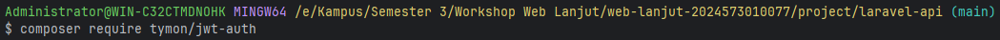
- Mempublish Config.  
  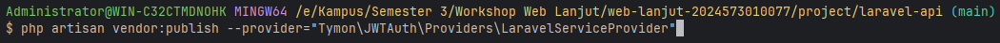
- Mengenerate Secret Keynya.  
  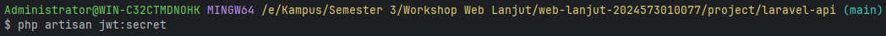
- Mengedit file config/auth.php.  
  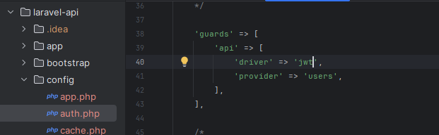
- Memodifikasi User Model.  
  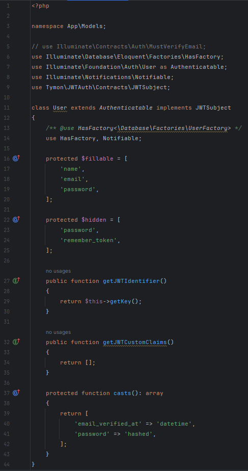
- Membuat file middleware JWTMiddleware.  
  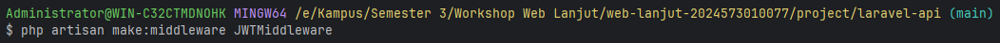
- Mengedit file JWTMiddleware.  
  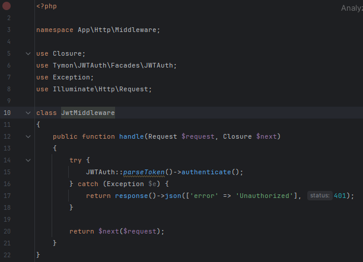
- Membuat file AuthController didalam folder API.  
  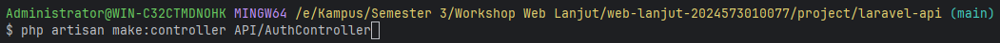
- Mengedit file AuthController.  
  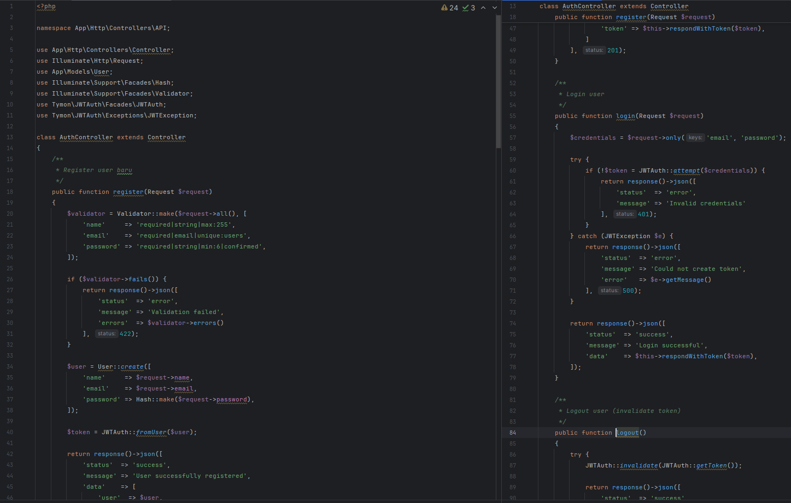
- Mengedit file api.php di folder routes.  
  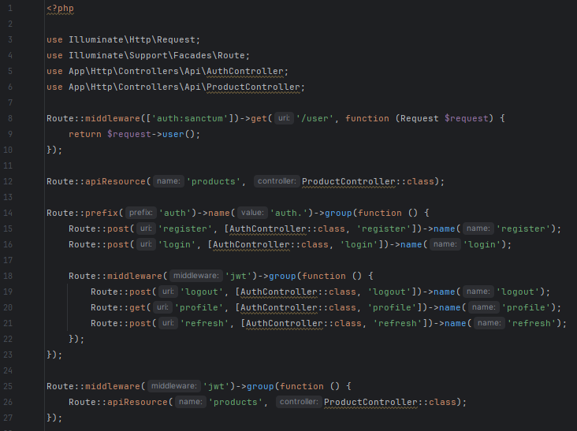
- Menjalankan aplikasi dan Menunjukkan hasil dibrowser.  
  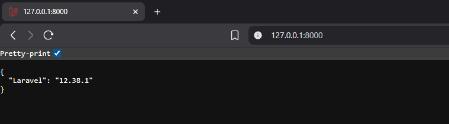
- Kemudian masuk ke aplikasi POSTMAN, jika belum ada bisa didownload terlebih dahulu diwebsite ini: https://www.postman.com/downloads/.
    - Buat request baru diPOSTMAN untuk register, dengan method POST, kemudian isi linknya sebagai berikut: http://127.0.0.1:8000/api/auth/register,
      kemudian pilih tab Body, lalu pilih raw, kemudian ganti textnya menjadi Json, isi seperti gambar dibawah, kemudian klik Send, untuk detailnya bisa dilihat digambar berikut:  
      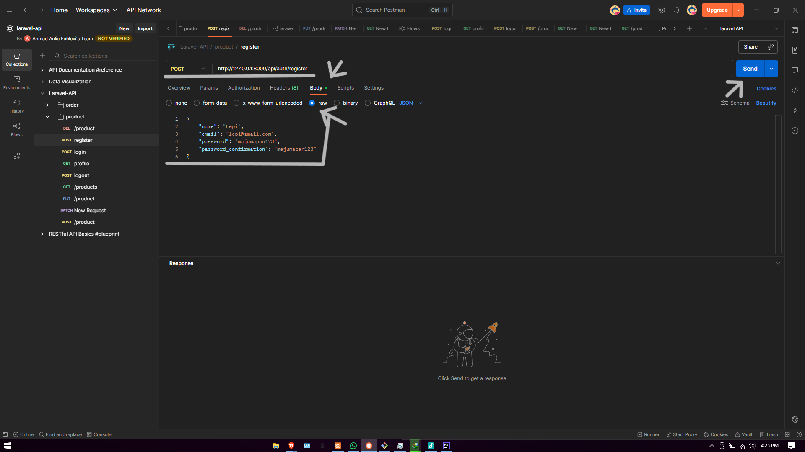
    - Jika data error maka tampilannya akan seperti ini:  
      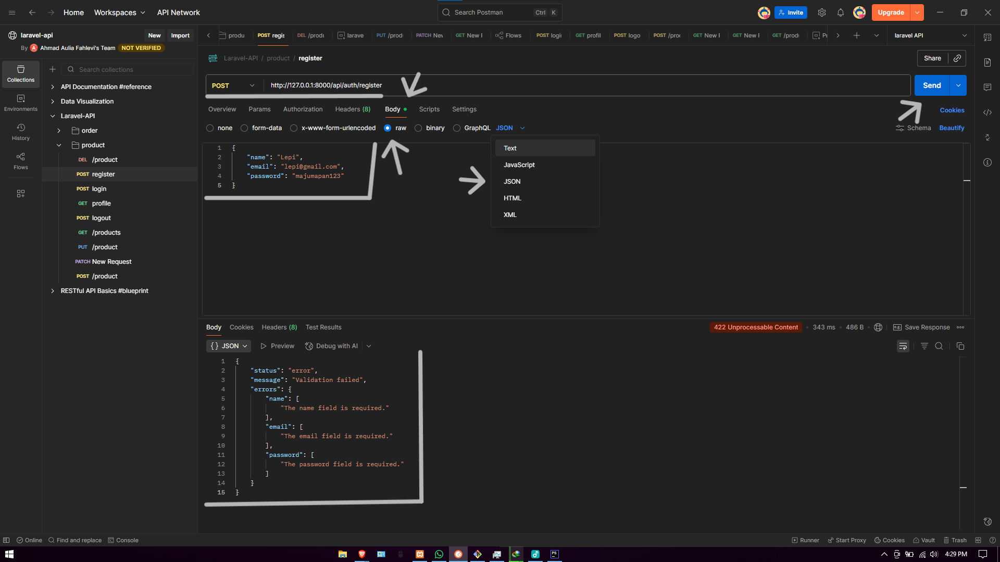
    - Jika data duplicate maka tampilannya akan seperti ini:  
      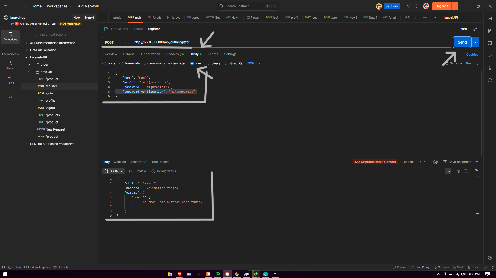
    - Lanjut buat request baru untuk login, dengan method POST, kemudian isi kembali link ini: http://127.0.0.1:8000/api/auth/login,
      kemudian pilih tab Body, kemudian pilih raw, lalu ganti textnya menjadi Json, isi seperti gambar dibawah, kemudian klik Send, untuk detailnya bisa dilihat digambar berikut:  
    - 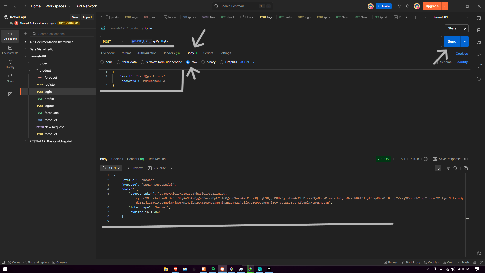
    - Setelah kita login maka kita akan mendapatkan tokennya, kemudian lanjut buat request baru untuk masuk ke profile, dengan method GET, kemudian isi lagi dengan link ini: http://127.0.0.1:8000/api/auth/profile,
      lalu sebelum kita Send kita masuk dulu ke dalam tab Headers, kemudian dibagian key diklik lalu kita pilih Authorization, kemudian di Value nya, isi kan dengan format begini "Bearer <token_yang_didapat_dari_login>", setalah itu jangan lupa kita centang
      kemudian kita klik Send, untuk detailnya bisa kita lihat digambar berikut:  
      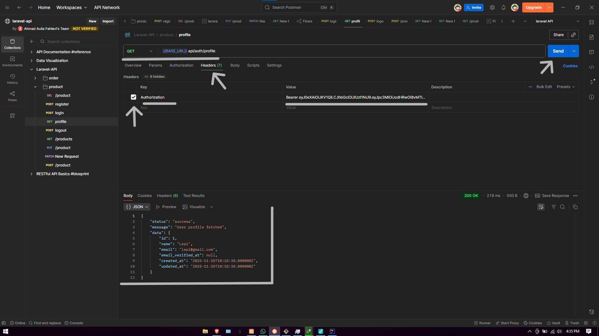
    - Jika tidak kita centang untuk Authorizationnya maka akan tampil seperti gambar dibawah ini:  
      
    - lanjut kita tes lagi untuk membuka product yang telah kita buat pada modul sebelumnya, dengan masuk ke request GET,
      kemudian masuk ke tab Header lagi, klik dibagian keynya, pilih Authorization, kemudian di Value kita isi dengan format ini: "Bearer <token_yang_didapat_dari_login>", jangan lupa untuk dicentang di Authorizationnya
      lalu langsung kita Send, untuk detailnya bisa dilihat pada gambar berikut:  
      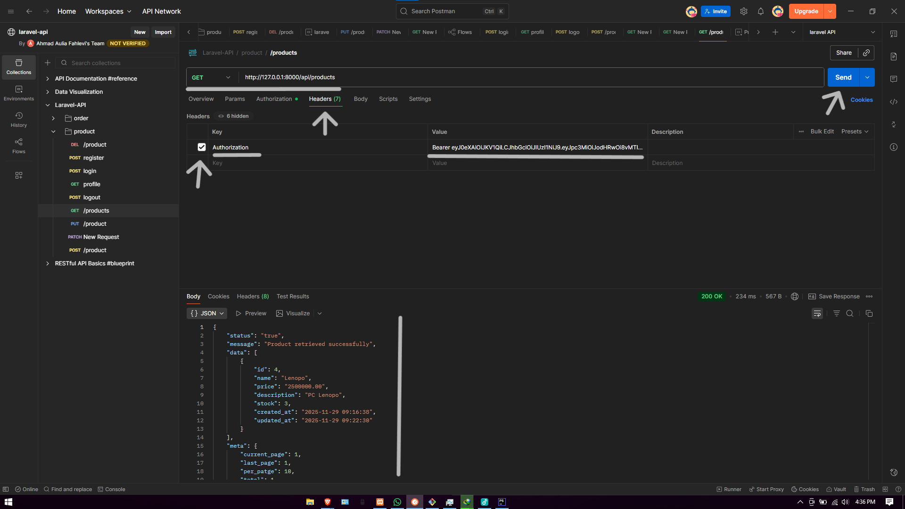
    - Jika tidak kita centang maka akan tampil seperti gambar dibawah ini:  
      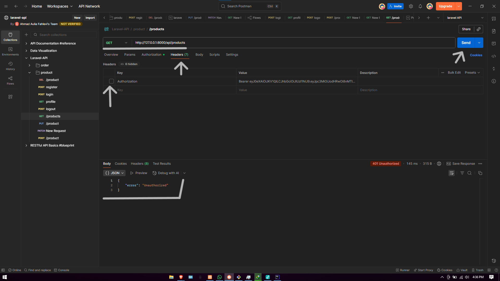

---

## 3. Hasil dan Pembahasan
Jelaskan apa hasil dari praktikum yang dilakukan.
- Apa Hasil dari Praktikum yang dilakukan?  
  Hasil dari praktikum ini adalah tersedianya proyek lengkap dengan autentikasi JWT di Laravel 12, yang mencakup: 
  pendaftaran pengguna, login menghasilkan token, proteksi route dengan middleware JWT, serta mekanisme token refresh/revoke. 
  Episode ini juga menyediakan link download repository final yang siap dipelajari dan dikembangkan.

- Bagaimana Validasi Input dan Proteksi Autentikasi Bekerja?  
  Meskipun di episode ini fokusnya pada pengunduhan source code, prior-episode menjelaskan bahwa pada proses register/login
  dilakukan validasi input (email unik, password minimal, dll). Setelah login berhasil, token JWT dihasilkan dan digunakan 
  pada header Authorization: Bearer. Middleware kemudian memeriksa token tersebut sebelum mengizinkan akses ke route proteksi. 
 Hal ini membuat API menjadi stateless dan aman.

- Apa Peran Masing-Masing Komponen (Route, Controller, Middleware, Model)?
  - Route: Mendefinisikan endpoint seperti /api/register, /api/login, /api/logout, dan route proteksi seperti /api/user 
    yang hanya bisa diakses bila token valid.
  - Controller: Mengelola logika register, login, logout, memperbarui user, menghasilkan dan menolak token.
  - Middleware: Memeriksa keberadaan dan validitas token JWT; jika tidak valid, menolak akses dengan respons JSON error (misalnya 401 Unauthorized).
  - Model (User): Mengimplementasikan JWTSubject agar token dapat dihasilkan dari user instance; dan menyimpan data user di database.

---

## 4. Kesimpulan

Implementasi autentikasi JWT di Laravel 12 memungkinkan pengembangan API yang lebih aman, stateless, dan cocok untuk 
aplikasi modern seperti mobile dan SPA. Dengan sumber kode lengkap yang disediakan, pembaca dapat langsung mempelajari,
menjalankan, dan memodifikasi proyek nyata. Komponen utama seperti validasi input, token issuance, middleware proteksi 
route, dan model user terpadu membentuk arsitektur API yang siap dikembangkan ke fitur-lanjutan (misalnya otorisasi 
berbasis peran, token blacklist, pembatasan rate).

---

## 5. Referensi
- Sumber dari :
  - LagiKoding. (2024). Tutorial Laravel 12 JWT – 10 Download Source Code: https://lagikoding.com/episode/tutorial-laravel-12-jwt-10-download-source-code
  - Laravel Documentation. (2024). Laravel 12 Authentication & API: https://laravel.com/docs
  - JWT.io. JSON Web Token Introduction.: https://jwt.io/introduction
  - PHP Official Documentation. PHP 8.x Manual.: https://www.php.net/docs.php
  - REST API Concepts – Mozilla Developer Network (MDN).: https://developer.mozilla.org/en-US/docs/Glossary/REST

---