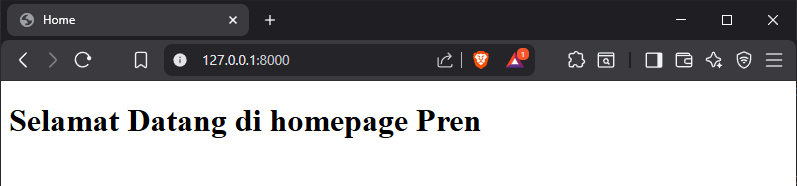
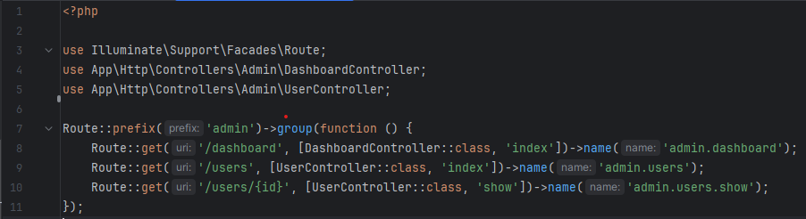

# Laporan Modul 3: Laravel Controller
**Mata Kuliah:** Workshop Web Lanjut   
**Nama:** Ahmad Aulia Fahlevi  
**NIM:** 2024573010077
**Kelas:** TI-2C

---

## Abstrak
DI Laporan ini berfokus pada konsep-konsep dasar pengembangan web menggunakan framework Laravel, khususnya implementasi 
arsitektur MVC (Model-View-Controller). Bagian inti dari pembahasan adalah Controller, yang bertindak sebagai jembatan 
utama yang menerima permintaan (request) dari Route, mengelola logika bisnis (berinteraksi dengan Model), dan menentukan 
tampilan (View) yang akan dikirimkan sebagai response. Melalui praktikum sederhana (seperti membuat halaman sambutan dan
kalkulator), kita diajak untuk memahami alur kerja sebuah request HTTP dan peran krusial Controller dalam mengorganisasi
kode dan menjalankan logika aplikasi.
---

## 1. Dasar Teori
- MVC (Model, View, Controller) adalah sebuah pola arsitektur perangkat lunak yang memisahkan aplikasi menjadi tiga komponen utama untuk mengelola aspek-aspek yang berbeda:
  - **Model:** Mengelola data dan logika bisnis aplikasi. Ini adalah bagian yang berinteraksi langsung dengan database untuk mengambil, menyimpan, atau memanipulasi data.
  - **View:** Bertanggung jawab untuk menampilkan data kepada pengguna. Ini adalah antarmuka (interface) pengguna yang bisa berupa halaman HTML, form, atau elemen visual lainnya.
  - **Controller:** Bertindak sebagai perantara antara Model dan View. Controller menerima permintaan (request) dari pengguna, memprosesnya dengan berinteraksi dengan Model, dan kemudian mengirimkan data yang sesuai ke View untuk ditampilkan.

- **Peran Controller di Laravel**
  - **Fungsi Utama:** Controller adalah salah satu bagian dari konsep MVC yang diusung oleh Laravel. Di dalamnya, kita menuliskan logika bisnis dari fitur yang akan dibuat.
    - **Pengolahan Permintaan:** Controller merupakan sebuah class yang didalamnya terdapat method - method yang bertugas mengolah
      permintaan (request) dari pengguna dan memberikan balikan (response).
    - **Alur Kerja:** Controller menerima request yang sudah diarahkan oleh Route, mengelola data dengan Model, dan memilih 
      View yang tepat untuk ditampilkan.
    - **Organisasi Kode:** Controller membantu mengelelompokkan logika penanganan request yang terkait ke dalam satu kelas,
       sehingga mempermudah pengelolaan dan pengorganisasian kode (manage and organize your code).

- **Keterkaitan dengan Routing dan Request**
  - **Routing:** Keterkaitan Controller dengan Route sangat erat. Umumnya, Route akan mengarahkan request dari pengguna 
    ke method tertentu yang ada dalam Controller.
  - **Request dan Reponse:** Controller adalah titik di mana request HTTP diproses setelah melewati Middleware dan Router,
    sebelum akhirnya menghasilkan response yang dikirimkan kembali kepada pengguna.
---

## 2. Langkah-Langkah Praktikum
Tuliskan langkah-langkah yang sudah dilakukan, sertakan potongan kode dan screenshot hasil.

2.1 Praktikum 1 – Menangani Request dan Reponse View di Laravel 12

- Membuat controller DemoController. 

- Menambahkan route pada routes/web.php. 

- Membuat View Sederhana. 

  - View greet.blade.php 
    
  - View  hello.blade.php 
    
  - View search.blade.php 
    
- Menjalankan aplikasi dan Menunjukkan hasil dibrowser. 

2.2 Praktikum 2 – Menggunakan Group Route

- Membuat controller PageController. 
  
- Menambahkan route yang dikelompokkan                                         
  
- Membuat view Sederhana. 
  
  - View home.blade.php 
    
  - View about.blade.php 
    
  - View contact.blade.php 
    
- Menjalankan aplikasi dan Menunjukkan hasil dibrowser. 

2.3 Praktikum 3 – Pengelompokan Prefix dengan Namespace Rute di Laravel 12

- Membuat controller DashboardController dan UserController. 
  
- Menambahkan route yang dikelompokkan.                                  
  
- Membuat view Sederhana. 
  
    - View dashboard.blade.php 
      
    - View index.blade.php 
      
    - View show.blade.php 
      
- Menjalankan aplikasi dan Menunjukkan hasil dibrowser. 

---

## 3. Hasil dan Pembahasan
Jelaskan apa hasil dari praktikum yang dilakukan.
- Apa Hasil dari Praktikum yang dilakukan?  
  Secara keseluruhan, praktikum berhasil memvalidasi dan mendemonstrasikan siklus hidup **Request-Response Laravel** secara 
  fundamental. Hasilnya adalah:
  - **Validasi Fungsionalitas:** Aplikasi web sederhana (Halaman Sambutan, Rute Dinamis, Halaman Admin) berhasil dibangun dan 
    berfungsi sesuai route yang didefinisikan.
  - **Organisasi Kode:** Praktikan menguasai penggunaan Route Grouping dan Namespace untuk membuat definisi rute yang bersih 
    dan terstruktur.
  - **Penanganan Data:** Berhasil menangani berbagai bentuk request (parameter URL dan query string) dan meneruskannya sebagai 
    data yang dapat ditampilkan di View.

- Bagaimana Validasi Input Bekerja di Laravel?  
  Validasi input bekerja dengan memastikan data yang dikirim oleh pengguna mematuhi aturan yang telah ditentukan (required, email, max:255, dll.).
  - **Fungsi:** Validasi ini sangat penting untuk mencegah data yang tidak valid, berbahaya, atau tidak lengkap masuk ke proses Controller atau database.
  - **Metode:** Validasi dapat dilakukan langsung di dalam method Controller menggunakan \$request->validate() atau, yang lebih 
    disarankan untuk kode yang bersih, menggunakan Kelas Form Request (php artisan make:request ...).

- Apa peran Masing-Masing Komponen (Route, Controller, View) dalam Program yang Dibuat?
  - **Route = Gerbang Masuk:** Menerima alamat URI dan mengarahkan request ke method Controller yang spesifik.
  - **Controller = Otak Logika:** Menerima request dari Route, mengolah data (validasi, pemrosesan), dan memilih View atau response akhir.
  - **View = Antarmuka:** Bertugas menampilkan hasil pemrosesan data dari Controller kepada pengguna dalam format HTML (Blade Template).

---

## 4. Kesimpulan

Bab ini membahas dasar-dasar Controller di Laravel, mencakup cara membuat Controller, mendefinisikan rute untuk mengarahkannya, 
dan meneruskan data ke View.

Kita juga mempelajari berbagai jenis Controller (seperti Resource dan Invokable Controller) dan teknik pengelompokan rute 
(route grouping) untuk organisasi kode yang lebih baik.

Inti pembahasan meliputi penanganan permintaan (request), validasi input, dan pengembalian berbagai jenis respons (response). 
Konsep-konsep ini diperkuat melalui lab praktik, menjadikannya fondasi penting untuk topik Laravel yang lebih lanjut.

---

## 5. Referensi
- Sumber dari :
  - Laraval 12 Training Kit: A Practical Guide to Modern Web Development. Link: https://lnkd.in/gm6ms5cf
  - BELAJAR LARAVEL Tutorial Framework Laravel Untuk Pemula by SANDHIKA GALIH. Link: https://www.youtube.com/@sandhikagalihWPU
  - Website Full Stack Open. Link: https://fullstackopen.com/en/
  - Tutorial Laravel 10 / 9 - Part #2 - Route dan Controller. Link: https://indokoding.net/

---