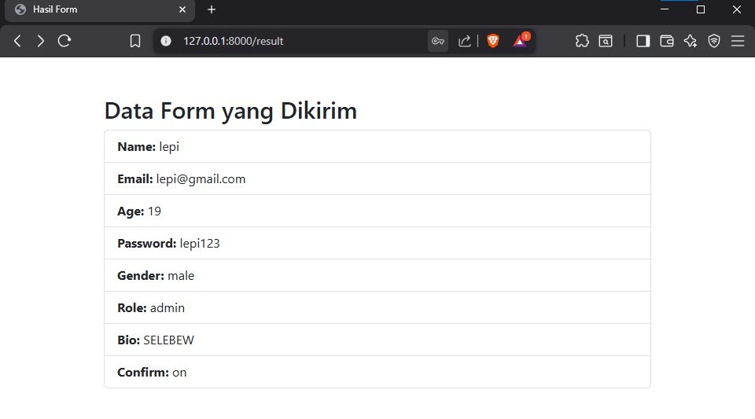
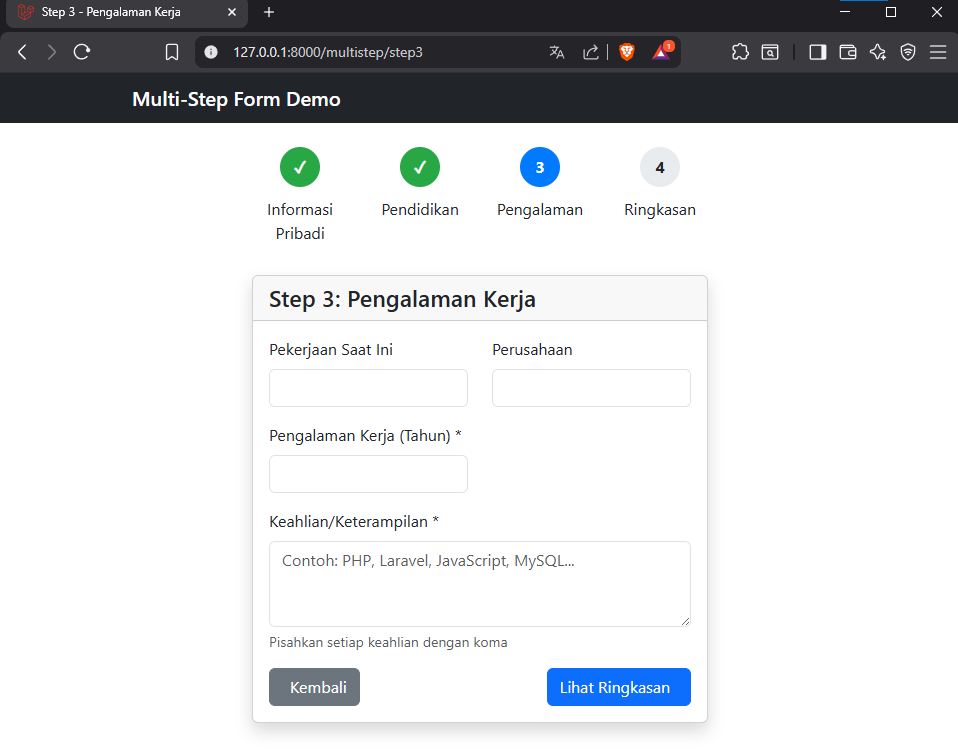

# Laporan Modul 5: Form Submission & Data Validation
**Mata Kuliah:** Workshop Web Lanjut   
**Nama:** Ahmad Aulia Fahlevi  
**NIM:** 2024573010077
**Kelas:** TI-2C

---

## Abstrak
Modul ini berfokus pada penanganan form submission dan validasi data yang merupakan aspek krusial dalam keamanan dan 
fungsionalitas aplikasi web Laravel. Modul ini menjelaskan arsitektur Request-Response dan menekankan pentingnya CSRF 
Protection yang diimplementasikan melalui direktif @csrf. Secara inti, modul ini mendemonstrasikan sistem validasi data 
Laravel yang robust—mulai dari Controller Validation (inline) hingga Custom Validation Rules dan Custom Error Messages. 
Praktikum dirancang untuk membangun pemahaman fungsionalitas, termasuk implementasi validasi bawaan (required, email, min), 
penanganan Old Input untuk pengalaman pengguna yang baik, serta penerapan alur multi-step form dengan Session untuk 
mempertahankan data di setiap langkah.

---

## 1. Dasar Teori
- Arsitektur Form Submission & Metode HTTP
  - Siklus Hidup: Form submission di Laravel mengikuti alur Client (View) $\rightarrow$ Server (Route $\rightarrow$ Controller $\rightarrow$ Model) $\rightarrow$ Response.
  - Metode HTTP: Laravel mendukung metode POST (untuk create), PUT/PATCH (untuk update), dan DELETE. Karena HTML Form 
    terbatas pada GET dan POST, Laravel menggunakan Method Spoofing dengan direktif @method('PUT') atau @method('DELETE') untuk simulasi. 
- Perlindungan CSRF (Cross-Site Request Forgery)
  - Definisi: CSRF adalah serangan di mana penyerang memaksa pengguna terautentikasi untuk mengirimkan request yang tidak disengaja.
  - Mekanisme Laravel: Laravel mencegah serangan ini dengan Token-Based Protection. Direktif @csrf akan menghasilkan 
    hidden input field unik yang harus disertakan dalam setiap request POST, PUT/PATCH, atau DELETE. Middleware VerifyCsrfToken 
    akan membandingkan token di form dengan token di session pengguna; jika tidak cocok, request akan ditolak (Error 419).
- Data Validation
  - Tujuan: Validasi adalah pertahanan utama aplikasi, memastikan data yang masuk ke Controller atau database aman, lengkap, 
    dan sesuai dengan aturan bisnis (misalnya: required, min:8, email, unique:table).
  - Jenis Validasi:
    - Controller Validation (Inline): Menggunakan $request->validate([...]) langsung di dalam Controller.
    - Form Request Validation: Menggunakan kelas terpisah (php artisan make:request) untuk menjaga Controller tetap bersih.
  - Penanganan Error di View: Laravel secara otomatis mengikat validation errors ke variabel $errors (MessageBag). Directive 
    @error('field_name') digunakan untuk menampilkan pesan error di bawah field yang relevan.
  - Old Input: Fungsi old('field_name') digunakan untuk secara otomatis memuat kembali data yang diinput pengguna ke dalam form setelah validasi gagal, meningkatkan pengalaman pengguna.
---

## 2. Langkah-Langkah Praktikum
Tuliskan langkah-langkah yang sudah dilakukan, sertakan potongan kode dan screenshot hasil.

2.1 Praktikum 1 – Menangani Request dan Reponse View di Laravel 12
- Menambahkan route pada routes/web.php.  
  
- Membuat controller FormController.  
  
- Membuat View form.blade.php.  
  
- Membuat View result.blade.php
  
- Menjalankan aplikasi dan Menunjukkan hasil dibrowser.  
  
  

2.2 Praktikum 2 – Validasi Kustom dan Pesan Error di Laravel 12 
- Menambahkan route.                      
  
- Membuat controller RegisterController.  
  
- Membuat View register.blade.php.  
  
- Menjalankan aplikasi dan Menunjukkan hasil dibrowser.  
  

2.3 Praktikum 3 – Multi-Step Form Submission dengan Session Data
- Membuat Layout Dasar.  
  
- Membuat Routes.  
  
- Membuat controller MultiStepFormController.  
  
- Membuat View step1.blade.php.  
  
- Membuat View step2.blade.php.  
  
- Membuat View step3.blade.php.  
  
- Membuat View summary.blade.php.  
  
- Membuat View complete.blade.php.  
  
- Menjalankan aplikasi dan Menunjukkan hasil dibrowser.  
  - Step1  
     
  - Step2  
     
  - Step3  
     
  - Step4  
     
  - Step5 / Completed  
    
  
---

## 3. Hasil dan Pembahasan
Jelaskan apa hasil dari praktikum yang dilakukan.
- Apa Hasil dari Praktikum yang dilakukan?  
  Secara keseluruhan, praktikum berhasil memvalidasi dan mendemonstrasikan implementasi sistem **Form Submission dan Validasi 
  Data** yang robust dan user-friendly di Laravel. Hasil praktikum adalah:
    - **Formulir Lengkap & Validasi Dasar:** Berhasil membuat form registrasi komprehensif yang dijamin integritas datanya 
      menggunakan server-side validation bawaan Laravel (misalnya required, email, min). Data yang valid berhasil dikirim dan ditampilkan di halaman hasil.
    - **Interaktivitas & UX:** Berhasil mengimplementasikan fitur interaktif (seperti JavaScript untuk mengaktifkan tombol 
      submit hanya jika checkbox konfirmasi dicentang), yang meningkatkan pengalaman pengguna (User Experience) dan mencegah pengiriman form yang belum diverifikasi.
    - **Validasi Kustom & Feedback Jelas:** Berhasil mendemonstrasikan fleksibilitas sistem validasi Laravel dengan menerapkan 
      Pesan Error yang Dikustomisasi, membuat feedback kepada pengguna menjadi lebih informatif dan sesuai konteks.
    - **Multi-Step Form Management:** Berhasil mengelola alur kerja yang kompleks (form pendaftaran bertahap) dengan membagi 
      form menjadi beberapa langkah. Session Management digunakan secara efektif untuk mempertahankan state data antar langkah, 
      didukung oleh Progress Bar visual yang memberikan panduan terstruktur kepada pengguna.

- Bagaimana Validasi Input Bekerja di Laravel?  
  Validasi input bekerja dengan memastikan data yang dikirim oleh pengguna mematuhi aturan yang telah ditentukan (required, email, max:255, dll.).
    - **Fungsi Utama:** Validasi ini sangat penting untuk mencegah data yang tidak valid, berbahaya (misalnya, SQL injection), atau tidak lengkap masuk ke proses Controller atau database.
    - **Penerapan Inline:** Validasi dapat dilakukan secara langsung di dalam Controller menggunakan method $request->validate([...]). Jika validasi gagal, Laravel akan otomatis:
      - **Redirect Otomatis:** Mengarahkan kembali pengguna ke halaman form sebelumnya.
      - **Keunggulan:** Ini menjamin konsistensi visual di seluruh aplikasi dan mempermudah pembaruan tata letak secara massal.
    - Menampilkan Error: Di View, directive @error('field_name') dan fungsi old('field_name') digunakan untuk menampilkan 
      pesan error yang relevan dan memuat kembali data pengguna sebelumnya, sehingga memperbaiki pengalaman pengguna.

- Apa peran Masing-Masing Komponen (Route, Controller, View) dalam Program yang Dibuat?  
  Dalam konteks penanganan formulir dan validasi data, peran komponen-komponen tersebut menjadi sangat spesifik:    - **Controller (Otak Pemrosesan Data):**
  - **Route = Gerbang Request & Method Spoofing:**
    - **Peran:** Menerima alamat URI (/form atau /register) dan mengarahkan request (terutama POST) ke method Controller yang spesifik.
    - **Aksi Tambahan:** Dalam form submission untuk update/delete, Route bekerja sama dengan hidden field @method('PUT') di form untuk mengizinkan HTTP Method Spoofing.
  - **Controller = Otak Validasi & Pemrosesan:**
      - **Peran:** Menerima request dari Route dan bertugas menjadi garis pertahanan pertama data.
      - **Aksi:** Melakukan Validasi Data. Jika data valid, Controller memprosesnya (misalnya, menyimpannya ke session 
        dalam multi-step form atau menyimpannya ke database). Kemudian, Controller akan menentukan response (misalnya, redirect ke halaman hasil).
  - **View = Antarmuka Pengumpulan & Feedback:**
      - **Peran:** Menyajikan form HTML untuk pengumpulan data dan memberikan feedback atas kegagalan validasi.
      - **Aksi:** Menggunakan CSRF token (@csrf) untuk keamanan, menggunakan directive @error untuk menampilkan pesan error, dan menggunakan old() untuk mempertahankan input pengguna setelah redirect.
---

## 4. Kesimpulan

Praktikum ini berhasil mendemonstrasikan tiga aspek kunci dalam penanganan formulir Laravel:
- Pengembangan Formulir Lengkap & Interaktif: Berhasil membuat formulir registrasi yang komprehensif dengan berbagai tipe 
  input (teks, numerik, dropdown, dll.). Keberhasilan ini dilengkapi dengan implementasi validasi server-side Laravel dan 
  interaktivitas JavaScript (mengaktifkan tombol submit berdasarkan checkbox konfirmasi) untuk memastikan data yang valid 
  dan meningkatkan pengalaman pengguna (user experience).
- Validasi Lanjutan & Kustomisasi Error: Praktikum berhasil menunjukkan fleksibilitas Laravel dalam menerapkan Validasi 
  Kustom dan Pesan Error yang Disesuaikan. Hal ini sangat meningkatkan kejelasan dan informatifnya komunikasi feedback 
  kepada pengguna.
- Multi-Step Form (Formulir Bertahap): Praktikum membuktikan kemampuan Laravel dalam mengelola proses pengumpulan data 
  yang panjang melalui Formulir Bertahap. Dengan menggunakan Session Management untuk mempertahankan state data antar 
  langkah dan Progress Bar visual, praktikum menciptakan alur kerja yang terstruktur, intuitif, dan tidak membebani pengguna.

---

## 5. Referensi
- Sumber dari :
  - Laraval 12 Training Kit: A Practical Guide to Modern Web Development. Link: https://lnkd.in/gm6ms5cf
  - BELAJAR LARAVEL Tutorial Framework Laravel Untuk Pemula by SANDHIKA GALIH. Link: https://www.youtube.com/@sandhikagalihWPU
  - Website Full Stack Open. Link: https://fullstackopen.com/en/
  - Tutorial Laravel oleh ID Laravel. Link: https://id-laravel.com/post/tag/validation/
---