# Laporan Modul 7: Eloquent Relationship & Pagination
**Mata Kuliah:** Workshop Web Lanjut   
**Nama:** Ahmad Aulia Fahlevi  
**NIM:** 2024573010077
**Kelas:** TI-2C

---

## Abstrak
Praktikum ini berfokus pada pemanfaatan Eloquent ORM di Laravel untuk mendefinisikan dan berinteraksi dengan berbagai 
jenis relasi antar model dalam database MySQL. Relasi yang diimplementasikan meliputi One-to-One (User ↔︎ Profile), 
One-to-Many (User → Posts), dan Many-to-Many (Posts ↔︎ Tags). Prosesnya melibatkan pembuatan Migrations untuk skema 
database yang kompleks, pendefinisian Model dengan method relationship yang sesuai (hasOne, belongsTo, hasMany, 
belongsToMany), dan Seeder untuk mengisi data dummy. Hasil praktikum adalah aplikasi web fungsional yang mampu 
mengambil data terhubung secara efisien, menggunakan fitur Eager Loading (with()) untuk mengatasi masalah N+1 
Query, yang merupakan demonstrasi kunci dalam pengembangan aplikasi berbasis data yang kompleks dan berkinerja tinggi.
---

## 1. Dasar Teori
Dasar teori praktikum ini adalah Eloquent Relationship yang memungkinkan interaksi data antar tabel database menggunakan sintaks PHP berorientasi objek.
- **Jenis-Jenis Eloquent Relationship**
  - **One-to-One (hasOne/belongsTo):** Satu record dari satu model terhubung ke tepat satu record dari model lain (misalnya, User dan Profile). Relasi balik (Inverse) didefinisikan dengan belongsTo.
  - **One-to-Many (hasMany/belongsTo):** Satu record dari model induk terhubung ke banyak record di model anak (misalnya, satu User dapat memiliki banyak Post). Relasi balik selalu belongsTo.
  - **Many-to-Many (belongsToMany):** Banyak record dari satu model dapat terhubung ke banyak record dari model lain 
    (misalnya, Post dan Tag). Hubungan ini memerlukan tabel perantara (Pivot Table), yang dalam kasus ini dinamai post_tag.
  
- **Eager Loading (with())**
  - **Tujuan:** Untuk mengatasi masalah N+1 Query. Tanpa Eager Loading, jika mengambil 10 Post dan kemudian mengakses 
    User dari setiap Post secara terpisah, akan terjadi 1 query untuk Post ditambah 10 query untuk User (total 11 query).
  -**Implementasi:** Dengan menggunakan Model::with('relationship_name')->get(), Laravel hanya mengeksekusi 2 query: satu 
    untuk data utama, dan satu untuk semua data relasi terkait. Ini sangat penting untuk performa aplikasi.

- **Komponen Pendukung**
  - **Migrations:** Digunakan untuk mendefinisikan skema database secara terprogram, termasuk foreign key dan unique 
    constraints yang diperlukan untuk relasi (misalnya user_id pada tabel posts).
  - **Model dan Controller:** Model mendefinisikan hubungan, sementara Controller menggunakan method hubungan tersebut \
    untuk mengambil data dan meneruskannya ke View.

---

## 2. Langkah-Langkah Praktikum
Tuliskan langkah-langkah yang sudah dilakukan, sertakan potongan kode dan screenshot hasil.

2.1 Praktikum 1 – Eloquent ORM Relationships: One-to-One, One-to-Many, Many-to-Many
- Membuat Migrasi untuk Skema Database  
  
  - Mengedit Migrasi profile table yang sudah dibuat.  
    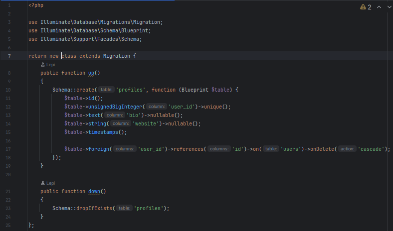
  - Mengedit Migrasi Posts table yang sudah dibuat.  
    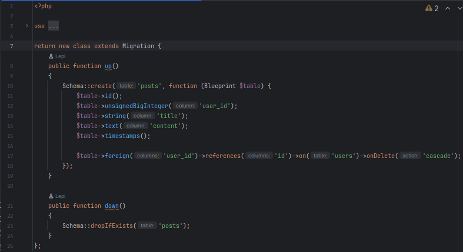
  - Mengedit Migrasi Tags table yang sudah dibuat.  
    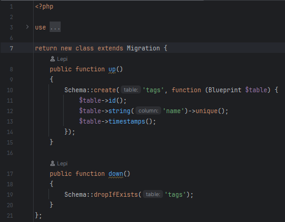
  - Mengedit Migrasi Tag tabel yang sudah dibuat.  
    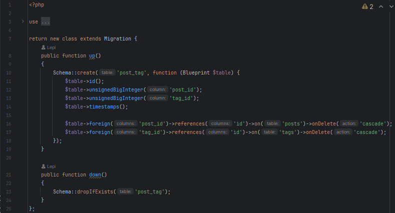
  - Setelah mengedit file migrasi. lalu lakukan migrasi dengan perintah "php artisan migrate"
- Mendefinisikan Model Eloquent  
  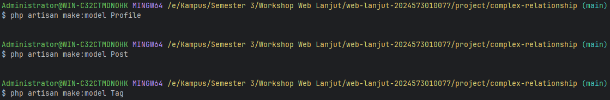
  - Mengedit file Model User.php  
    
  - Mengedit file Model Profile.php  
    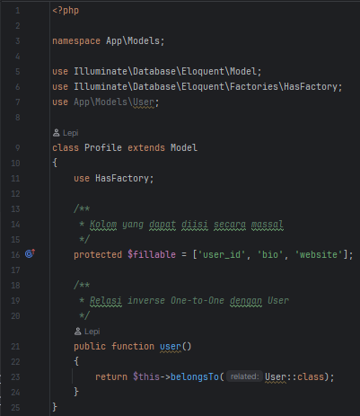
  - Mengedit file Model Post  
    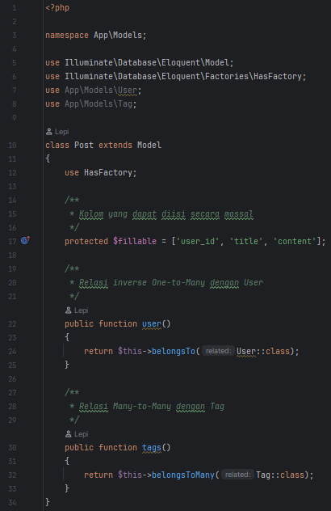
  - Mengedit file Model Tag  
    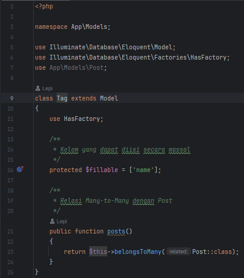
- Membuat Seeder lalu mengedit setelah itu menjalankannya dengan perintah "php artisan db:seed"  
  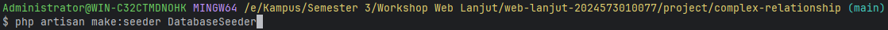  
  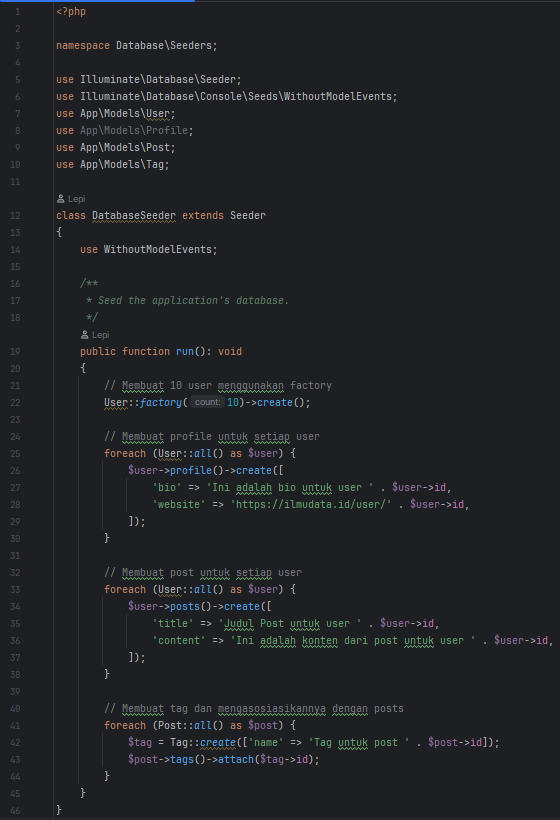
- Membuat Controller  
  - Membuat Controller UserController  
    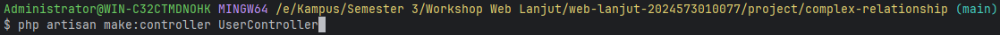
    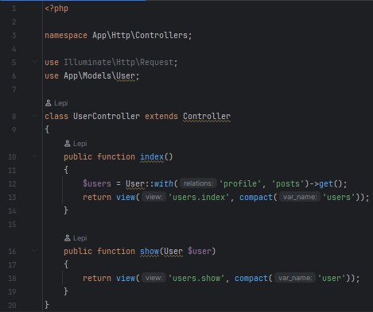
  - Membuat Controller PostController   
    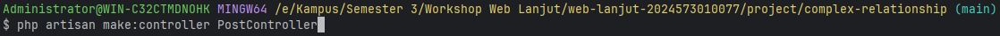
    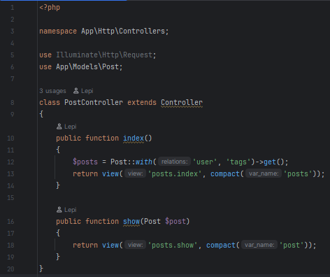
- Mendefinisikan Web Routes.  
  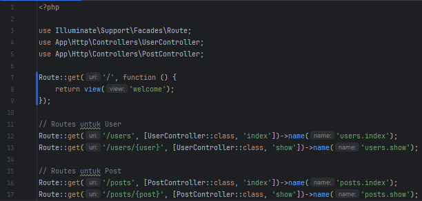
- Membuat Views Menggunakan Bootstrap.  
  - Membuat folder layouts dan file app.blade.php di resources/views.  
    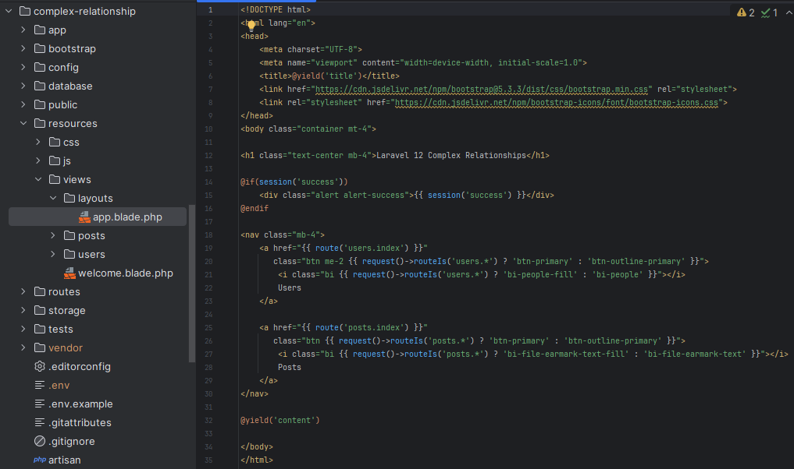
  - Membuat folder users di resources/views.  
    - Membuat Views index.blade.php.  
      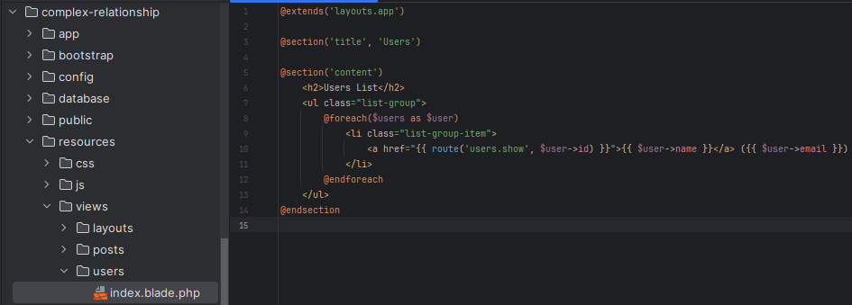
    - Membuat Views show.blade.php.  
      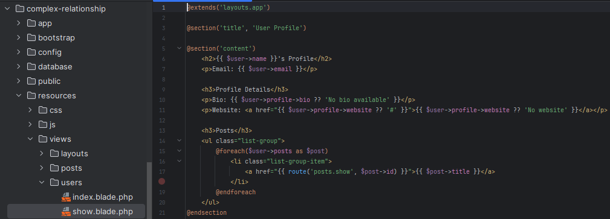
  - Membuat folder posts di resources/views.  
    - Membuat Views index.blade.php.  
      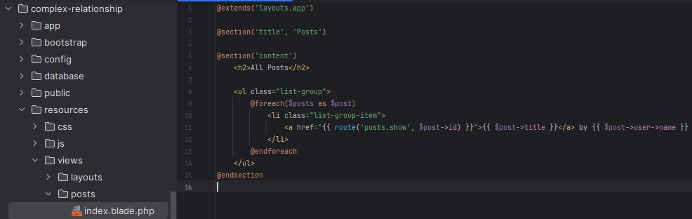
    - Membuat Views show.blade.php.  
      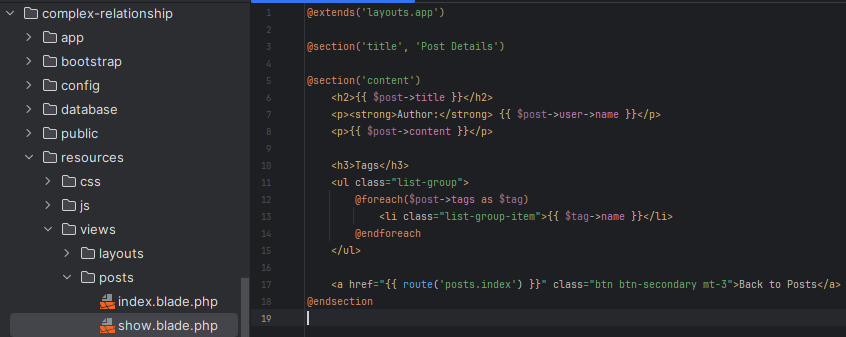
- Menjalankan aplikasi dan Menunjukkan hasil dibrowser.  
  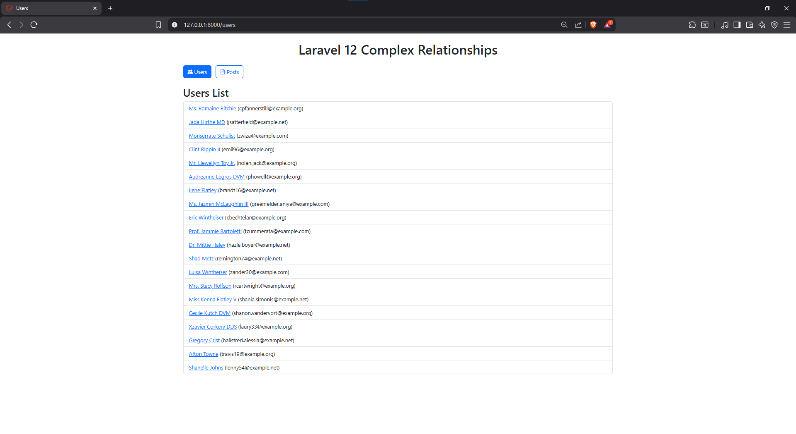
  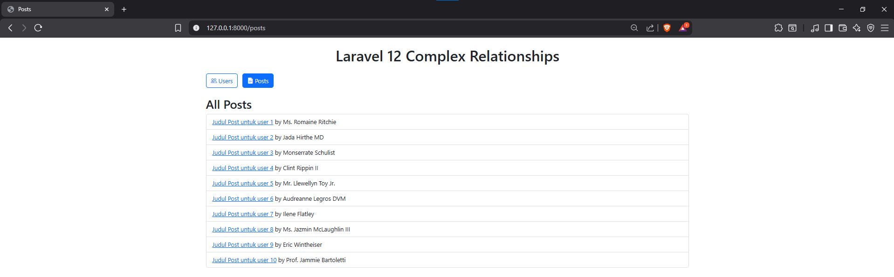

2.2 Praktikum 2 – Paginasi dengan Eloquent ORM
- Membuat Model dan Migrasi Product, lalu menjalankan migrasi dengan perintah "php artisan migrate"                                      
  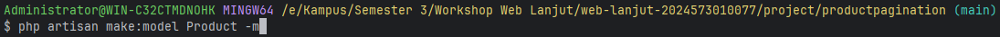
  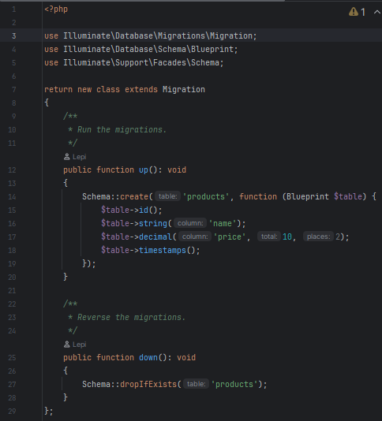
- Membuat Seeder untuk Data Dummy.  
  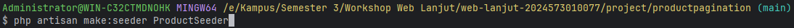
  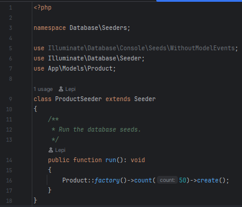
  - Memperbarui file app/models/product.php  
    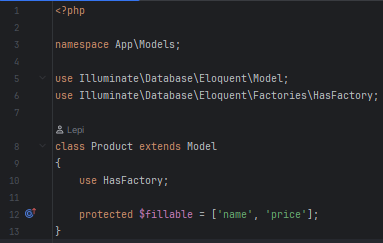
  - Membuat Factory untuk Model Product.  
    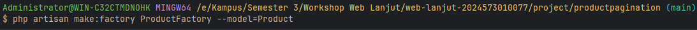
    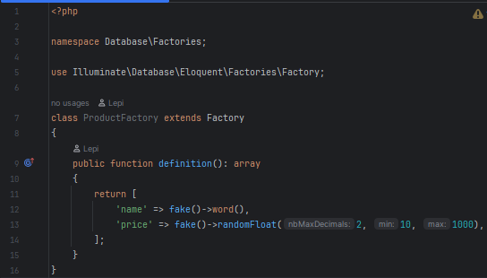
  - Memodifikasi file database/seeders/DatabaseSeeder.php, lalu menjalankan perintah "php artisan db:seed"
    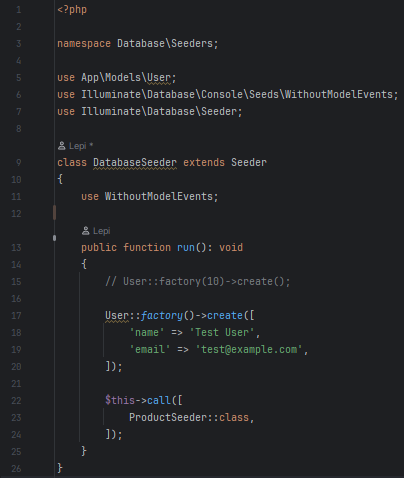
- Membuat Controller ProductController.  
  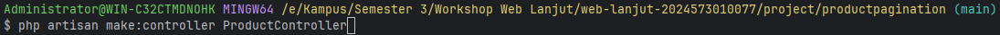
  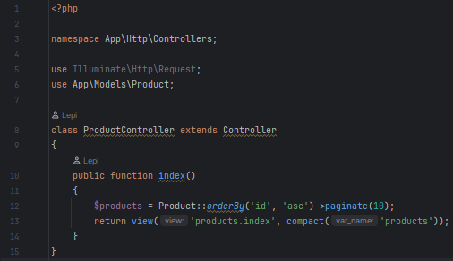
- Mendefinisikan Route  
  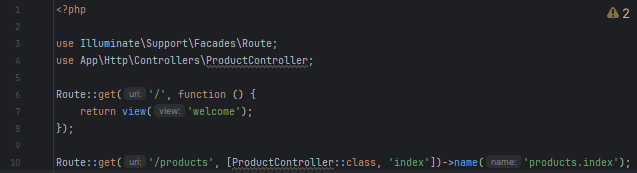
- Membuat View index.blade.php untuk Daftar Produk dengan Paginasi.   
  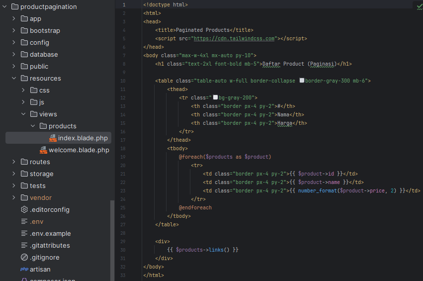
- Menjalankan aplikasi dan Menunjukkan hasil dibrowser.  
  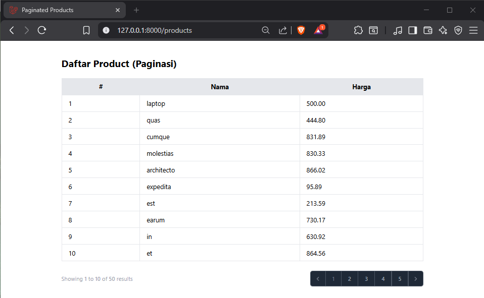

---

## 3. Hasil dan Pembahasan
Jelaskan apa hasil dari praktikum yang dilakukan.
- Apa Hasil dari Praktikum yang dilakukan?  
  Hasil dari praktikum ini adalah aplikasi berbasis data yang berhasil mengelola dan menampilkan data dari skema database kompleks dengan memanfaatkan Eloquent ORM:
  - **Skema Relasi Fungsional:** Semua relasi yang direncanakan berhasil diimplementasikan:
    - **One-to-One** (User ↔︎ Profile): Pengambilan data profil dari pengguna tertentu berjalan lancar (\$user->profile).
    - **One-to-Many** (User → Posts): Berhasil menampilkan semua postingan yang dimiliki oleh satu pengguna tertentu (\$user->posts).
    - **Many-to-Many** (Posts ↔︎ Tags): Berhasil mengaitkan banyak Tag ke satu Post dan sebaliknya, dengan pengambilan data Tag menggunakan \$post->tags.

  - **Penyelesaian N+1 Problem:** Penggunaan Eager Loading (Post::with('user', 'tags')->get()) di PostController berhasil 
    mengambil semua Post beserta User (penulis) dan Tag terkait hanya dalam jumlah query yang minimal, memastikan performa aplikasi yang optimal.

  - **Antarmuka Tampilan Data:** Berhasil menampilkan data relasi yang kompleks secara terstruktur di View (menggunakan 
    Bootstrap), memungkinkan navigasi yang jelas antar User dan Post mereka.

- Bagaimana Validasi Input Bekerja di Laravel?  
  Validasi input di Laravel bekerja sebagai mekanisme middleware awal di Controller (meskipun tidak secara eksplisit 
  ditunjukkan di method ini, ini adalah standar Laravel) untuk memastikan integritas data sebelum relasi Eloquent diproses.
  - **Penerapan pada Data Relasi:** Sebelum menyimpan data Post baru, validasi akan memastikan bahwa user_id, title, 
    dan content sesuai dengan aturan (misalnya title adalah required). Jika validasi gagal, Model tidak akan pernah dipanggil.

  - **Integritas Foreign Key:** Selain validasi input, integritas data relasi (seperti user_id di tabel posts) dijamin 
    oleh foreign key constraints yang didefinisikan dalam Migrations ($table->foreign('user_id')->references('id')->on('users')). 
    Ini memastikan bahwa Post tidak dapat dibuat tanpa User yang valid.

- Apa peran Masing-Masing Komponen (Route, Controller, View) dalam Program yang Dibuat?  
  Ketiga komponen ini bekerja secara sinergis untuk memproses dan menyajikan data relasional:
- - **Route (Penentu Jalur Relasi):**
    - **Peran:** Mendefinisikan endpoint untuk melihat data relasi.
    - **Aksi:** Menggunakan Route Model Binding (misalnya Route::get('/users/{user}', [UserController::class, 'show'])). 
      Route Model Binding secara otomatis mengambil instance Model User berdasarkan ID yang diberikan di URL, menyederhanakan kode Controller.

  - **Controller (Koordinator Query):**
    - **Peran:** Menentukan data apa yang harus diambil dan bagaimana data tersebut harus dimuat.
    - **Aksi:** Controller (misalnya PostController) memutuskan untuk menggunakan Eager Loading (with('user', 'tags')) saat 
      mengambil data. Controller tidak menulis HTML tetapi meneruskan objek Model yang sudah dimuat relasinya ke View.

  - **View (Penyaji Data Relasi):**
    - **Peran:** Bertanggung jawab menampilkan data yang terhubung secara logis dan mudah dibaca.
    - **Aksi:** Mengakses data relasi menggunakan notasi panah, seperti {{ \$post->user->name }} atau mengulang daftar 
      relasi Tag dengan @foreach(\$post->tags as \$tag). View hanya melakukan presentasi, bergantung sepenuhnya pada data 
      relasi yang sudah dimuat oleh Controller.

---

## 4. Kesimpulan

Praktikum Eloquent Relationship berhasil mendemonstrasikan bagaimana Laravel secara efektif mengelola dan menyajikan data 
dari skema database yang kompleks. Keberhasilan ini didukung oleh pendefinisian relasi yang akurat (hasOne, hasMany, 
belongsToMany) dalam Model. Pencapaian teknis terbesar adalah penerapan Eager Loading (with()), yang secara kritis 
mengatasi masalah N+1 Query, memastikan bahwa aplikasi dapat mengambil data relasional (seperti penulis Post dan 
Tags terkait) dengan performa tinggi. Melalui pemanfaatan Route Model Binding dan Eager Loading di Controller, serta 
penyajian yang jelas di View, praktikum ini membuktikan bahwa Eloquent adalah alat yang sangat kuat untuk mengembangkan 
aplikasi berbasis data yang kompleks secara efisien, terstruktur, dan performance-minded.

---

## 5. Referensi
- Sumber dari :
  - Laraval 12 Training Kit: A Practical Guide to Modern Web Development. Link: https://lnkd.in/gm6ms5cf
  - BELAJAR LARAVEL Tutorial Framework Laravel Untuk Pemula by SANDHIKA GALIH. Link: https://www.youtube.com/@sandhikagalihWPU
  - Website Full Stack Open. Link: https://fullstackopen.com/en/

---