# Laporan Modul 8: Authentication & Authorization
**Mata Kuliah:** Workshop Web Lanjut   
**Nama:** Ahmad Aulia Fahlevi  
**NIM:** 2024573010077
**Kelas:** TI-2C

---

## Abstrak
Praktikum ini mengeksplorasi dua pilar keamanan aplikasi web modern di Laravel: Autentikasi (verifikasi identitas pengguna) 
dan Otorisasi (menentukan izin akses pengguna). Tahap pertama berhasil mengimplementasikan sistem autentikasi dasar 
menggunakan Laravel Breeze untuk fitur registrasi, login, dan pengamanan rute dengan middleware auth. Tahap kedua 
berfokus pada Otorisasi Berbasis Peran (RBAC) dengan mendefinisikan peran (admin, manager, user). Hal ini dicapai 
dengan menambahkan kolom role pada tabel pengguna dan membuat Middleware Kustom (RoleMiddleware) untuk membatasi 
akses ke route spesifik. Hasil praktikum menunjukkan bahwa Laravel menyediakan tool yang powerful dan terstruktur 
untuk membangun sistem keamanan yang berlapis, dari validasi identitas hingga kontrol akses yang granular.
---

## 1. Dasar Teori
Dasar teori praktikum ini mencakup konsep inti keamanan web dan implementasinya dalam framework Laravel.
- **Autentikasi**(Authentication)
  - **Definisi:** Proses memverifikasi identitas pengguna, memastikan mereka adalah siapa yang mereka klaim.
    - **Implementasi Laravel:** Menggunakan starter kit Laravel Breeze untuk menyediakan scaffolding rute, controller, 
      dan view siap pakai untuk login, register, dan password reset. Laravel secara otomatis mengamankan kata sandi menggunakan bcrypt dan mengelola sesi melalui cookies aman.
    - **Middleware auth:** Digunakan untuk melindungi rute, memastikan hanya pengguna yang telah terautentikasi (sudah login) yang dapat mengakses rute atau grup rute tertentu.
- **Otorisasi (Authorization)**
  - **Definisi:** Digunakan untuk melindungi rute, memastikan hanya pengguna yang telah terautentikasi (sudah login) yang dapat mengakses rute atau grup rute tertentu.
  - **Sistem Laravel:** Otorisasi dapat diimplementasikan menggunakan Gates (closure sederhana) dan Policies (kelas untuk logika otorisasi berbasis Model).
  - **Role-Based Access Control (RBAC):** Merupakan pendekatan yang lebih maju, yang dilakukan dalam praktikum ini dengan:
    - Menambahkan field role ke tabel users.
    - Membuat Middleware Kustom untuk memeriksa nilai field role pengguna sebelum mengizinkan akses ke rute.
- **Komponen Pendukung**
  - **Migrations dan Seeder:** Digunakan untuk memodifikasi struktur database (menambahkan kolom role) dan mengisi data pengguna awal dengan peran yang sudah ditentukan.
  - **Middleware Kustom:** Merupakan mekanisme yang mencegat permintaan HTTP. Middleware khusus ini digunakan untuk memverifikasi apakah \$request->user()->role cocok dengan peran yang diizinkan pada route.
---

## 2. Langkah-Langkah Praktikum
Tuliskan langkah-langkah yang sudah dilakukan, sertakan potongan kode dan screenshot hasil.

2.1 Praktikum 1 – Autentikasi dan Otorisasi dengan Laravel 12 Breeze
- Menginstall Laravel Breeze  
  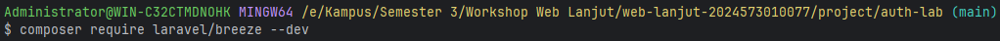
  - Kemudian jalankan perintah "php artisan breeze:install" untuk menginstall Brezee, selama proses instalasi, kita akan 
    diminta  beberapa opsi:
    - Pilih frontend framework: Pilih blade
    - Dark mode: Pilih yes (opsional)
  - Lanjutkan dengan perintah
    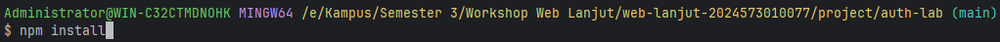
  - Lalu lanjutkan dengan perintah
    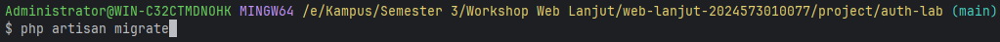
  - Akses Register dan Login via Web Interface  
    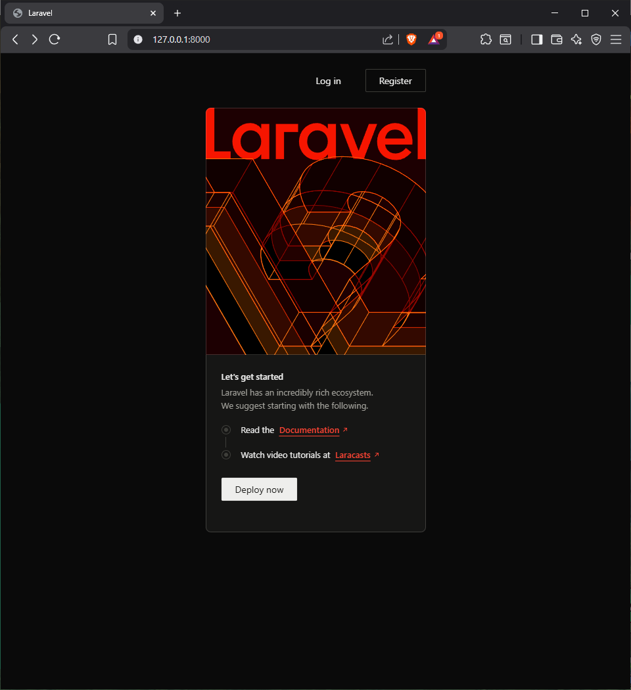
- Membuat Rute Profile yang Dilindungi di routes/web.php 
  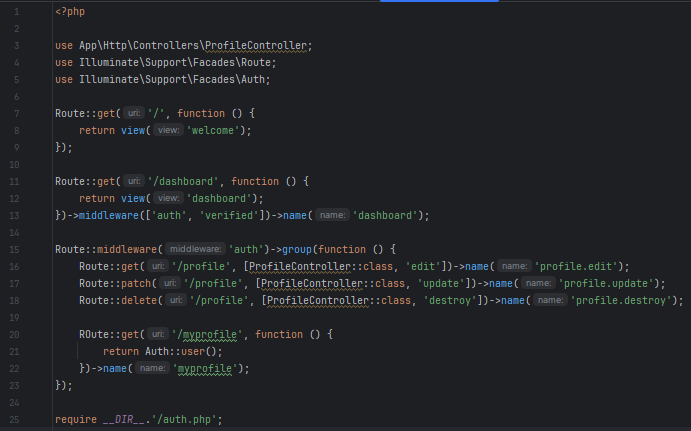
- Menjalankan aplikasi dan Menunjukkan hasil dibrowser.  
  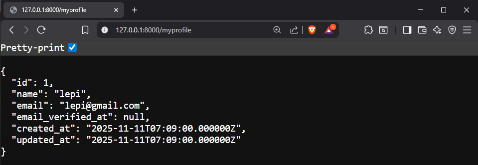

2.2 Praktikum 2 – Membatasi Akses Berdasarkan Peran di Laravel 12
- Menginstall Laravel Breeze  
  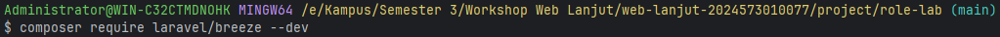
    - Kemudian jalankan perintah "php artisan breeze:install" untuk menginstall Brezee, selama proses instalasi, kita akan
      diminta  beberapa opsi:
        - Pilih frontend framework: Pilih blade
        - Dark mode: Pilih yes (opsional)
    - Lanjutkan dengan perintah
      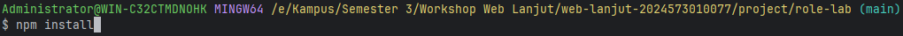
    - Lalu lanjutkan dengan perintah
      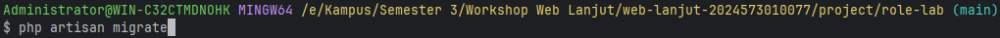
- Menambahkan Field Role ke Tabel Users.                                      
  - Membuat Migration setelah di edit kemudian kita jalankan dengan perintah "php artisan migrate"
    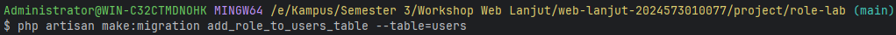
    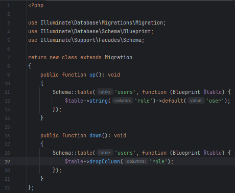
- Membuat Seeding Pengguna dengan Peran Berbeda, setelah selesai kita jalankan "php artisan db:seed"  
  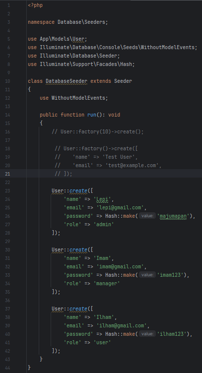
- Membuat Role Middleware kemudian kita daftarkan di bootstrap\app.php.  
  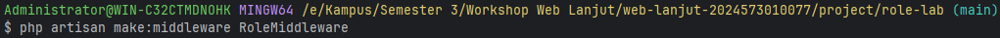
  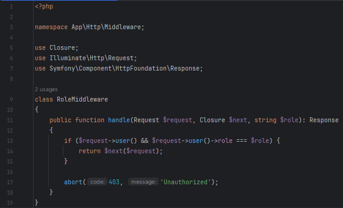
  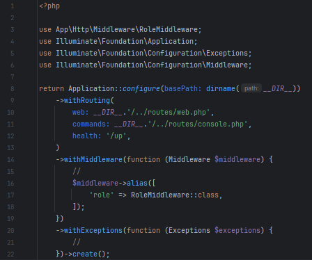
- Membuat View untuk Setiap Role.  
  - Membuat Views admin.blade.php.  
    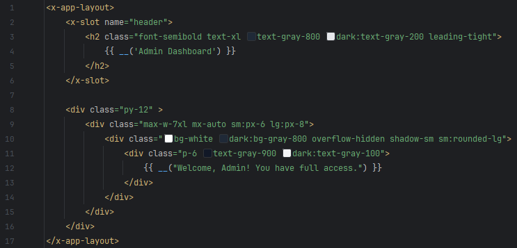
  - Membuat Views manager.blade.php.  
    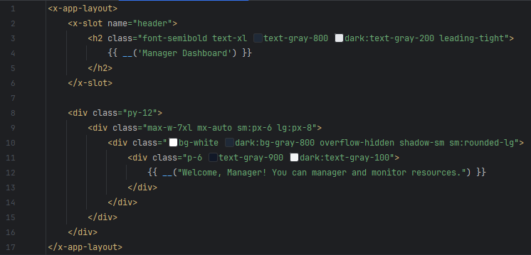
  - Membuat Views user.blade.php.  
    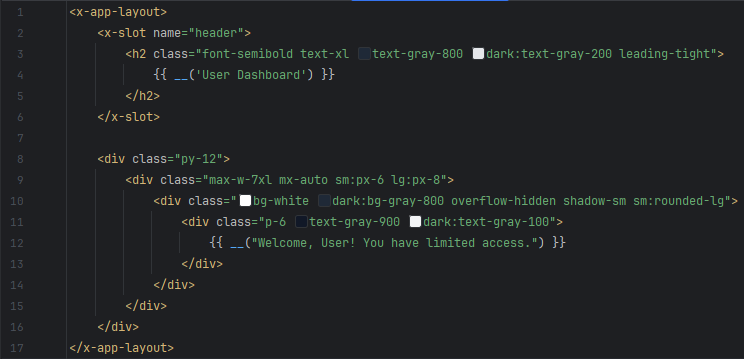
  - Membuat Views all.blade.php.  
    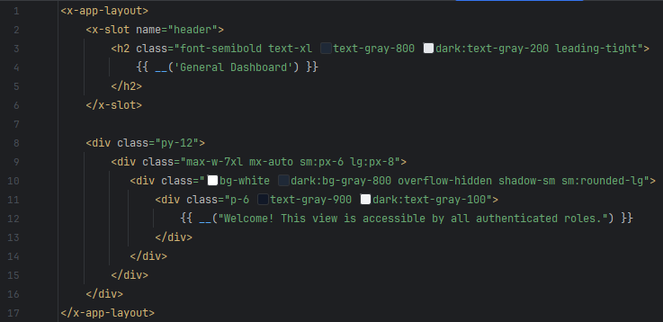
- Mendefinisikan Rute untuk View Berbasis Role.  
  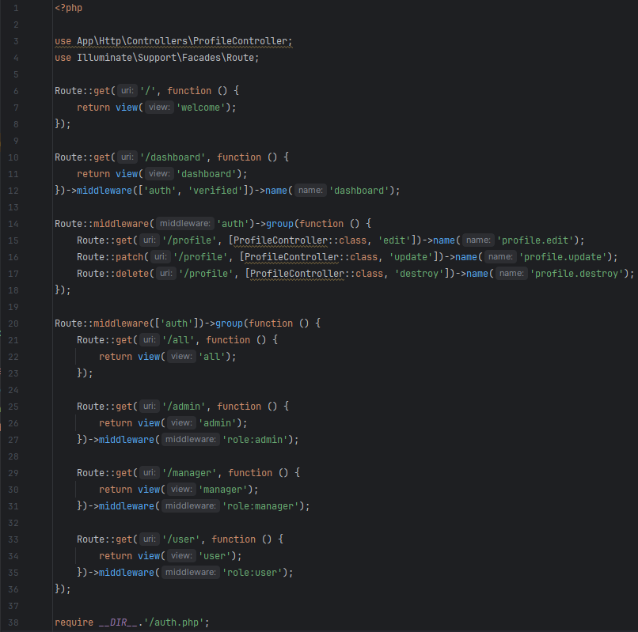
- Menjalankan aplikasi dan Menunjukkan hasil dibrowser.  
  - Tampilan admin
    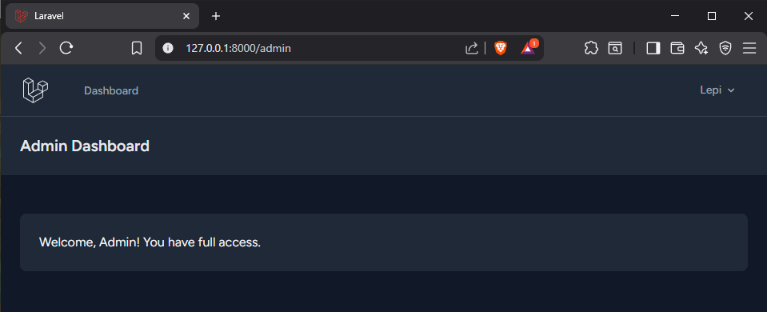
  - Tampilan manager
    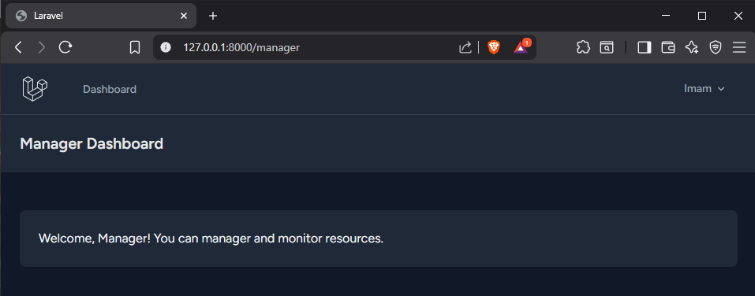
  - Tampilan user
    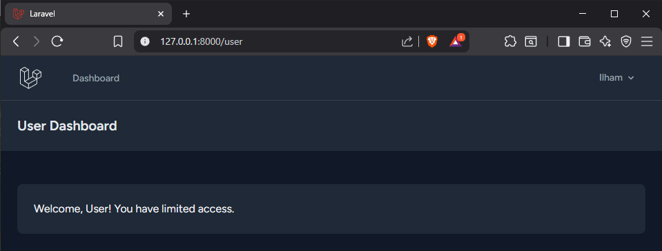
  - Tampilan all
    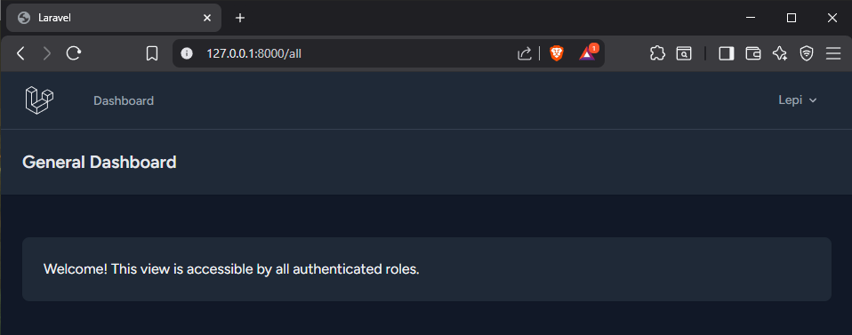
  - Tampilan user yang mencoba mengakses situs admin
    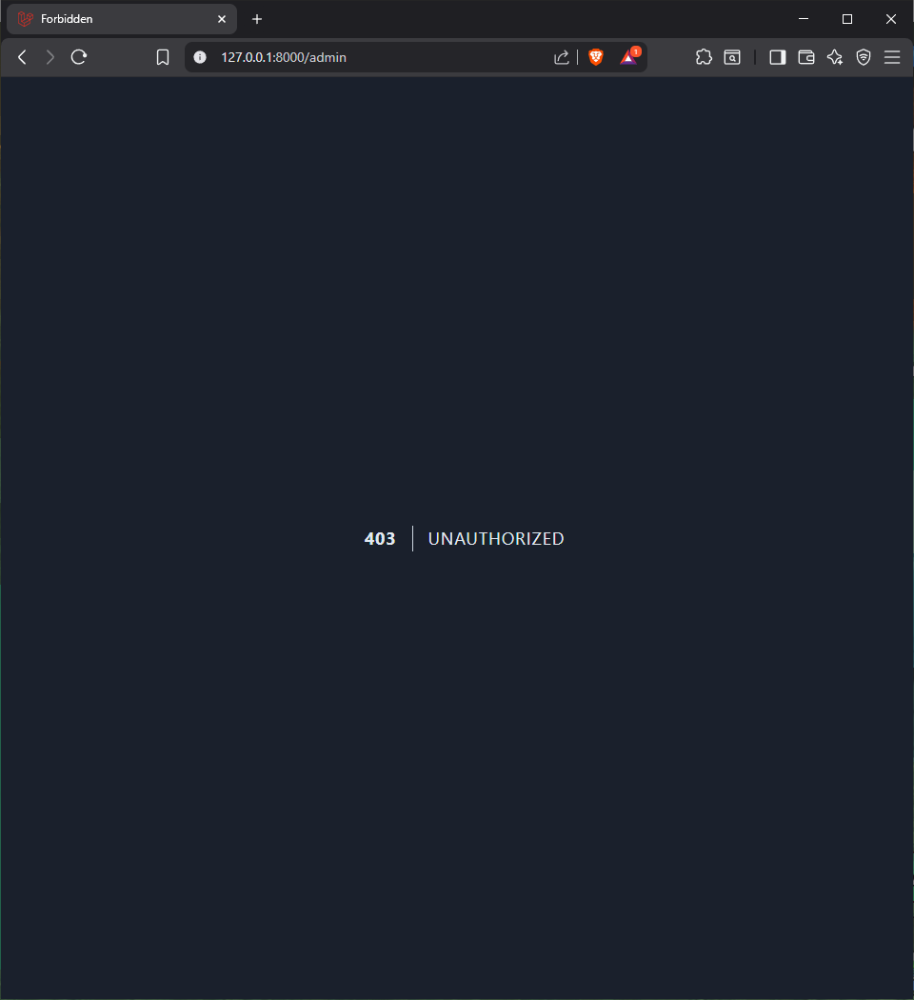
---

## 3. Hasil dan Pembahasan
Jelaskan apa hasil dari praktikum yang dilakukan.
- Apa Hasil dari Praktikum yang dilakukan?  
  Hasil dari praktikum ini adalah dua sistem keamanan yang terpisah namun komplementer, yang berjalan di Laravel:
  - **Sistem Autentikasi Dasar Fungsional (Praktikum 1):** Berhasil menginstal dan mengkonfigurasi Laravel Breeze, 
    menghasilkan alur kerja login dan register yang lengkap. Pengujian rute /myprofile yang dilindungi middleware auth 
    membuktikan bahwa sistem secara efektif membatasi akses hanya untuk pengguna yang telah login, dan mengembalikan data 
    pengguna yang terautentikasi (dalam format JSON).

  - **Sistem Otorisasi RBAC Fungsional (Praktikum 2):** Berhasil membuat dan menerapkan kontrol akses berbasis peran. 
    Hal ini ditunjukkan dengan keberhasilan pengguna admin, manager, dan user dalam mengakses rute umum (/all) dan rute 
    khusus peran mereka (misalnya /admin hanya dapat diakses oleh Admin). Akses yang salah (misalnya Manager mencoba 
    mengakses /admin) akan menghasilkan respons "403 Unauthorized" yang dikelola oleh RoleMiddleware kustom.

- Bagaimana Validasi Input Bekerja di Laravel?  
  Meskipun praktikum ini tidak secara eksplisit fokus pada validasi formulir, Laravel Breeze menyediakan validasi input saat proses registrasi:
  - **Validasi Otomatis:** Ketika pengguna mendaftar (seperti di Praktikum 1), Laravel Breeze (melalui Controller yang dihasilkannya) secara 
    otomatis menerapkan aturan validasi (required, email, unique, min:8 untuk password) pada input.

  - **Keamanan Kata Sandi:** Input kata sandi dienkripsi menggunakan fungsi hashing bcrypt sebelum disimpan ke database, 
    menjamin keamanan data sensitif meskipun database diretas.

  - **Middleware & Keamanan:** Setelah login, keamanan lebih lanjut diperkuat oleh middleware auth (yang memeriksa Autentikasi) 
    dan middleware role (yang memeriksa Otorisasi). Ini merupakan lapisan pengamanan yang terjadi setelah input awal divalidasi.

- Apa peran Masing-Masing Komponen (Route, Controller, View) dalam Program yang Dibuat?  
  Ketiga komponen ini berperan dalam menegakkan kebijakan keamanan dan menampilkan interface yang sesuai:
  - **Route (Gerbang Keamanan):**
    - **Peran:** Mendefinisikan jalur akses dan menentukan kebijakan keamanan yang harus diterapkan. 
    - **Aksi:** Menggunakan middleware chain. Contoh:
      - Praktikum 1: ->middleware('auth') untuk semua yang login.
      - Praktikum 2: ->middleware('role:admin') untuk membatasi akses hanya untuk peran admin. Route adalah penegak kebijakan keamanan pertama.

  - **Controller (Pengelola Sesi dan Akses):**
    - **Peran:** Mengelola proses login/logout (Autentikasi) dan menyiapkan data yang dilindungi (Otorisasi). 
    - **Aksi:** Controller Breeze menangani penyimpanan data pengguna baru. Di Praktikum 1, Controller digunakan untuk mendapatkan data pengguna terautentikasi (Auth::user()) untuk rute /myprofile.

  - **View (Antarmuka Pengguna):**
    - **Peran:** Bertanggung jawab penuh untuk merender struktur HTML dan menampilkan data yang dikirimkan oleh Controller. Menampilkan antarmuka yang berbeda berdasarkan status autentikasi dan otorisasi pengguna.
    - **Aksi:** 
      - Menampilkan antarmuka yang berbeda berdasarkan status autentikasi dan otorisasi pengguna.
      - Menampilkan Admin Dashboard (admin.blade.php) atau Manager Dashboard (manager.blade.php) hanya ketika pengguna 
        telah lolos pemeriksaan akses dari middleware yang sesuai.

---

## 4. Kesimpulan

Praktikum ini berhasil mengimplementasikan sistem keamanan berlapis di Laravel, dimulai dari fondasi Autentikasi menggunakan 
Laravel Breeze, yang menyediakan mekanisme login, register, dan enkripsi kata sandi yang kuat. Kesuksesan ini dilanjutkan 
dengan implementasi sistem Otorisasi Berbasis Peran (RBAC) yang advanced. Melalui penambahan kolom role, seeding pengguna, 
dan pembuatan Middleware Kustom (RoleMiddleware), aplikasi secara efektif dapat membatasi akses pengguna (admin, manager, 
user) ke view dan rute yang hanya ditujukan bagi mereka, sementara rute umum tetap terbuka bagi semua yang terautentikasi. 
Secara keseluruhan, praktikum ini membuktikan bahwa arsitektur Laravel (dengan middleware dan kemampuan kustomisasi) sangat 
ideal untuk mengembangkan aplikasi dengan kebutuhan keamanan yang terstruktur, fleksibel, dan scalable.

---

## 5. Referensi
- Sumber dari :
  - Laraval 12 Training Kit: A Practical Guide to Modern Web Development. Link: https://lnkd.in/gm6ms5cf
  - BELAJAR LARAVEL Tutorial Framework Laravel Untuk Pemula by SANDHIKA GALIH. Link: https://www.youtube.com/@sandhikagalihWPU
  - Website Full Stack Open. Link: https://fullstackopen.com/en/

---