# Laporan Modul 9: RESTful API Menggunakan Laravel 12
**Mata Kuliah:** Workshop Web Lanjut   
**Nama:** Ahmad Aulia Fahlevi  
**NIM:** 2024573010077
**Kelas:** TI-2C

---

## Abstrak
Tutorial "Laravel 12 RESTful API" di LagiKoding membimbing pembaca (khususnya pemula) untuk membangun sebuah API CRUD 
menggunakan Laravel versi 12. Seri tutorial ini dimulai dari instalasi Laravel, pembuatan model dan migrasi database, 
validasi request, resource JSON, hingga controller untuk operasi CRUD (Create, Read, Update, Delete). Seluruh alur dibuat 
agar API yang dihasilkan cukup rapi, terstruktur, dan mudah dikonsumsi oleh frontend atau klien lainnya. Tutorial juga 
menyediakan link untuk mengunduh source code lengkap dari proyek, sehingga pembaca dapat belajar dari implementasi nyata.
---

## 1. Dasar Teori
Beberapa landasan teori (teknis) yang menjadi fondasi dalam tutorial ini:
- RESTful API
  - API dibuat mengikuti gaya REST (Representational State Transfer), yang menggunakan HTTP verbs seperti GET, POST, 
    PUT/PATCH, DELETE untuk operasi data.
  - REST API ideal untuk komunikasi antara front-end (misalnya aplikasi web atau mobile) dengan backend karena fleksibel dan terstruktur.

- Model & Migrasi
  - Laravel menggunakan Eloquent ORM; model mewakili tabel dalam database. Dalam tutorial, dibuat model Product dengan migrasi untuk tabel products.
  - Migrasi berguna untuk membuat skema tabel (kolom id, name, price, description, stock, dan timestamp) secara deklaratif.
  - Properti $fillable di model Eloquent digunakan agar kolom tertentu bisa diisi melalui mass assignment.

- Validasi Request

  - Menggunakan request class khusus (seperti ProductRequest) untuk memvalidasi data input dari klien sebelum disimpan ke database (episode “Product Request”).
- Resource & Collection
  - Laravel Resource digunakan untuk membentuk respons JSON yang lebih terstruktur dan konsisten.
  - Resource Collection untuk menampung koleksi data (misalnya daftar produk), terutama berguna kalau data dipaginasi. 
    Collection menyertakan meta seperti current_page, last_page, dan total.
  - Penggunaan resource membantu debugging dan memudahkan ekspansi API di masa depan.

-  Controller & Routing
  - Controller (ProductController) menangani logika bisnis: menampilkan semua produk, menyimpan produk baru, menampilkan 
    satu produk, memperbarui, dan menghapus produk.
  - Laravel menyediakan Route::apiResource yang otomatis membuat route untuk operasi CRUD sesuai konvensi REST.
    Lagikoding
  - Respon API dikembalikan dalam format JSON dengan struktur yang jelas: status, pesan, data, dan bila koleksi, meta pagination.

- Pengunduhan & Setup Proyek
  - Tutorial menyediakan cara mengunduh source code (via GitHub), mengonfigurasi .env, menjalankan migrasi, dan menjalankan server Laravel.
- Dengan source code, pembaca bisa langsung menjalankan proyek nyata dan bereksperimen.
---

## 2. Langkah-Langkah Praktikum
Tuliskan langkah-langkah yang sudah dilakukan, sertakan potongan kode dan screenshot hasil.

Praktikum 1 – Membuat RESTful API menggunakan Laravel 12
- Menginstall Laravel dengan nama laravel-api.  
  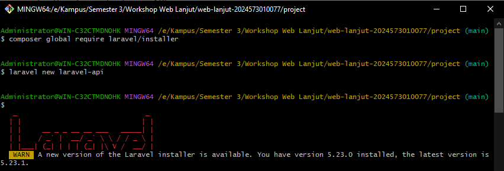
- Lalu sekarang kita install laravel api nya, dikarenakan pada laravel versi terbaru untuk apinya harus kita install terpisah.  
  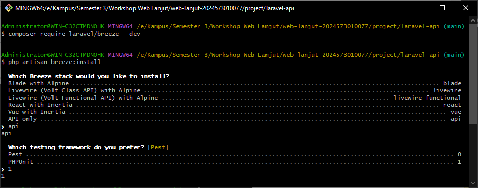
- Membuat file Model dan Migration Product.  
  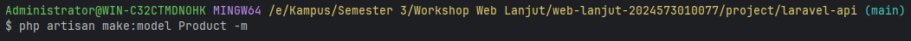
- Mengedit file Migration Product.  
  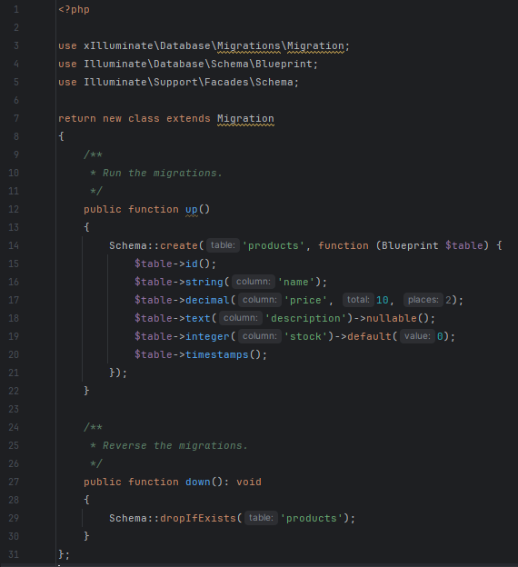
- Mengedit file Model Product.  
  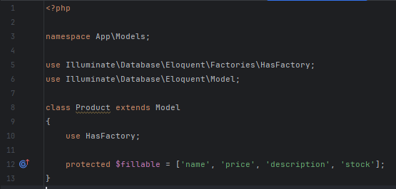
- Membuat file ProductRequest.  
  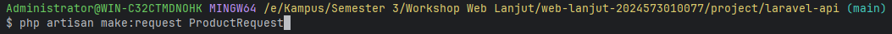
- Mengedit file ProductRequest.  
  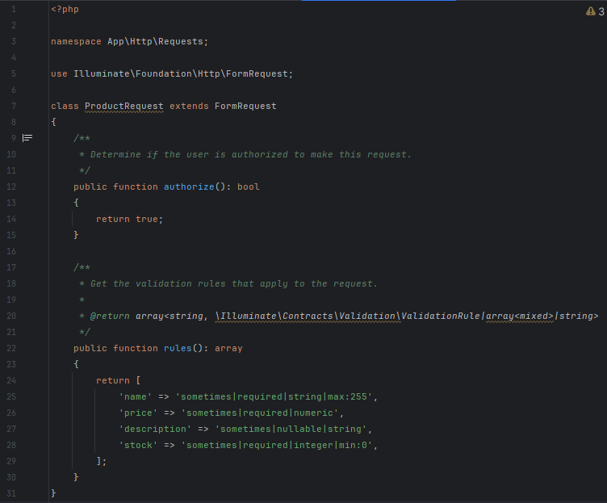
- Membuat file ProductResponse.  
  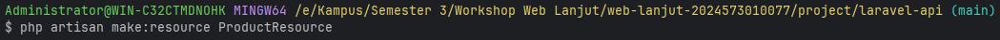
- Mengedit file ProductResponse.  
  
- Membuat file ProductCollection.  
  
- Mengedit file ProductCollection.  
  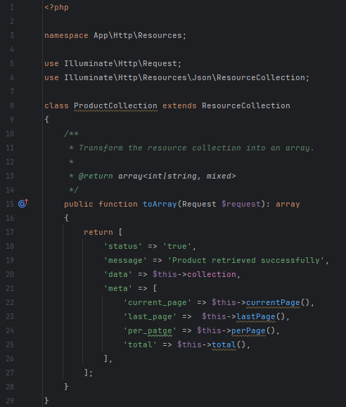
- Membuat file ProductController yang berada di dalam folder API.  
  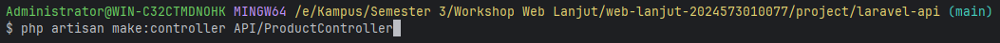
- Mengedit file ProductController 
  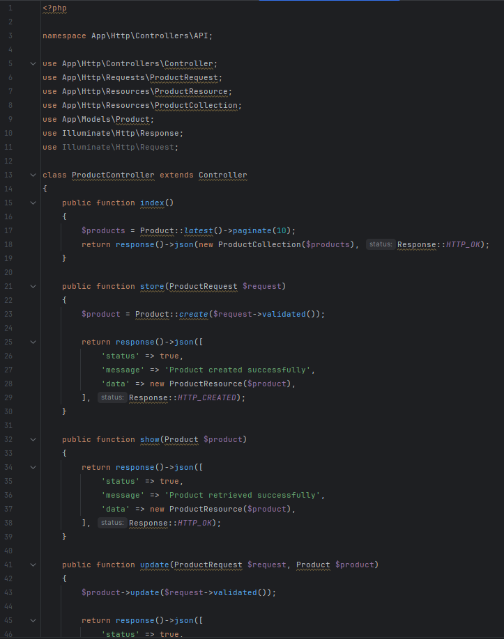
- Membuat file api.php di folder routes 
  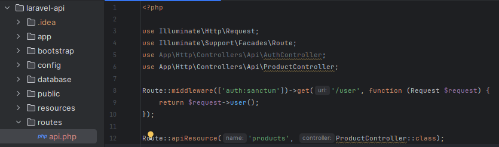
- Menjalankan aplikasi dan Menunjukkan hasil dibrowser.  
  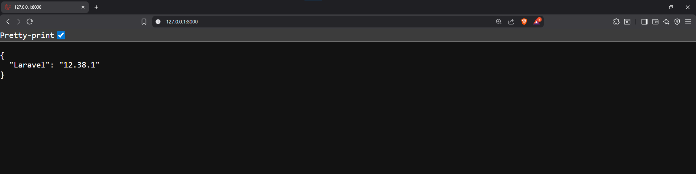
- Kemudian masuk ke aplikasi POSTMAN, jika belum ada bisa didownload terlebih dahulu diwebsite. 
  - Buat folder baru diPOSTMAN, kemudian buat request baru di postman dengan method GET, kemudian isi link menggunakan 
    link yang kita pada saat menjalankan aplikasi, kemudian kita klik Send, untuk detailnya bisa dilihat di gambar berikut:  
    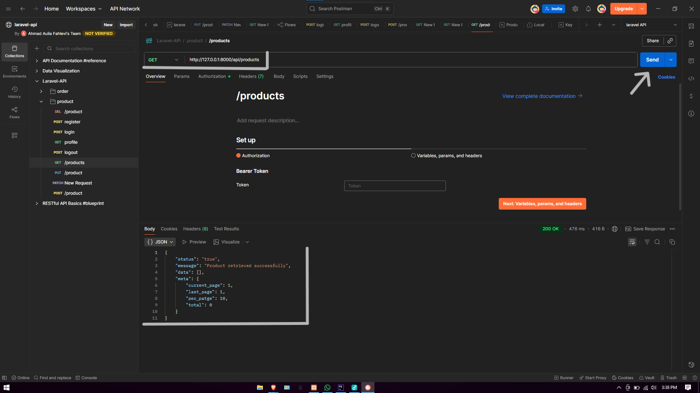
  - lanjut buat request baru untuk create product, dengan method POST, kemudian isi kembali link ini: http://127.0.0.1:8000/api/products,
    kemudian pilih tab Body, kemudian pilih raw, kemudian ganti textnya menjadi Json, isi seperti gambar dibawah, kemudian klik Send, untuk detailnya bisa dilihat digambar berikut:  
    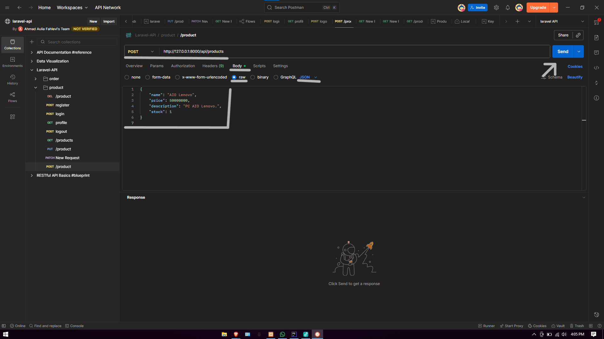
  - lanjut buat request baru untuk update product, dengan method PUT, kemudian isi lagi dengan link ini: http://127.0.0.1:8000/api/products/1,
    untuk nomor dibelakangnya disesuaikan dengan id yang telah kita liat dapat diGET setelah kita create, kemudian masuk lagi ke tab Body,
    kemudian pilih raw lagi, jangan lupa untuk ganti textnya menjadi Json, lalu ubah isi seperti gambar dibawah, kemudian klik Send, untuk detailnya bisa kita lihat digambar berikut:  
    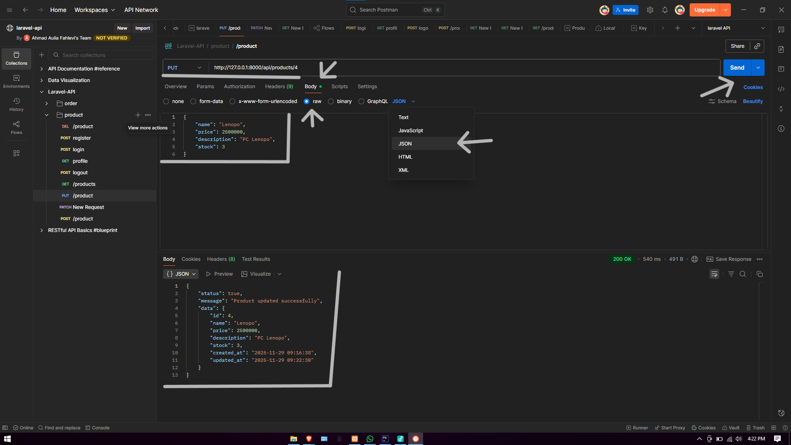    
  - lanjut untuk delete product, dengan method DELETE, kemudian isi lagi dengan link ini: http://127.0.0.1:8000/api/products/1,
    untuk nomor dibelakangnya disesuaikan dengan id yang telah didapat dari GET tadi, lalu langsung kita Send, untuk detailnya bisa dilihat pada gambar berikut:  
    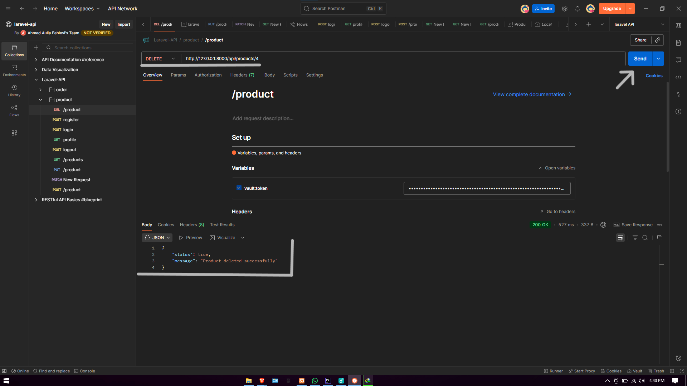

---

## 3. Hasil dan Pembahasan
Jelaskan apa hasil dari praktikum yang dilakukan.
- Apa Hasil dari Praktikum yang dilakukan?  
  Hasil praktikum ini adalah sebuah RESTful API CRUD Produk yang berfungsi penuh di Laravel 12:
  - Struktur Data & Model: Tabel products berhasil dibuat dan model dapat digunakan untuk menyimpan serta mengakses data. 
  - Validasi & Input Aman: Request yang masuk divalidasi otomatis, dan error ditampilkan dalam format JSON. 
  - CRUD Berjalan: Endpoint untuk melihat, menambah, mengedit, dan menghapus produk dapat digunakan dan memberikan respons JSON rapi. 
  - Resource & Collection: Data dikirimkan ke klien dalam format yang terstruktur dan konsisten.

- Bagaimana Validasi Input Bekerja di Laravel? 
  - Laravel menggunakan Form Request untuk memeriksa input sebelum masuk ke controller. 
  - Jika data tidak sesuai aturan (misalnya nama wajib atau harga harus numerik), API langsung mengembalikan pesan error JSON. 
  - Validasi membantu menjaga keamanan dan mencegah data salah masuk ke database.

- Apa Peran Masing-Masing Komponen (Route, Controller, Model, Resource)?
  - Route (Gerbang Akses):
    Mengatur endpoint dengan apiResource dan menentukan ke controller mana request dikirim.
  - Controller (Pengelola Proses CRUD):
    Mengolah data yang sudah valid, lalu melakukan create, read, update, dan delete. 
  - Model (Penghubung Database):
    Mengatur struktur data products dan mengelola operasi database melalui Eloquent ORM. 
  - Resource (Formatter Output JSON):
    Menyusun tampilan JSON agar respons API tetap rapi, konsisten, dan mudah dibaca klien.

---

## 4. Kesimpulan

Tutorial ini sangat cocok untuk pemula yang ingin mempelajari cara membuat RESTful API dasar dengan Laravel 12 karena 
disajikan secara bertahap mulai dari instalasi hingga CRUD lengkap. Penggunaan Model, Request Validation, Resource, dan 
Controller membuat API yang dihasilkan menjadi bersih, terstruktur, dan mudah dikelola. Penerapan resource dan collection 
juga membuat respons JSON lebih standar, intuitif, serta dilengkapi metadata penting seperti paginasi yang berguna untuk 
kebutuhan front-end. Tersedianya source code siap pakai memudahkan pembaca untuk langsung menjalankan, mempelajari, dan 
memodifikasi proyek. Secara keseluruhan, tutorial ini memberikan pondasi kuat untuk pengembangan API yang lebih kompleks 
di masa depan, seperti penambahan autentikasi, middleware, atau fitur lanjutan lainnya.

---

## 5. Referensi
- Sumber dari :
  - LagiKoding. (2024). Tutorial Laravel 12 JWT – 09 Register User: https://lagikoding.com/episode/tutorial-laravel-12-jwt-09-register-user    - Laravel Documentation. (2024). Laravel 12 Authentication & API: https://laravel.com/docs
  - JWT.io. JSON Web Token Introduction.: https://jwt.io/introduction
  - PHP Official Documentation. PHP 8.x Manual.: https://www.php.net/docs.php
  - REST API Concepts – Mozilla Developer Network (MDN).: https://developer.mozilla.org/en-US/docs/Glossary/REST

---